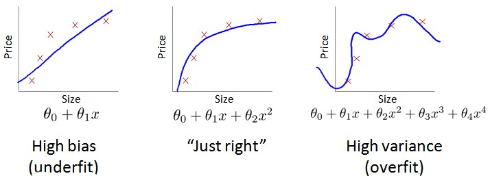
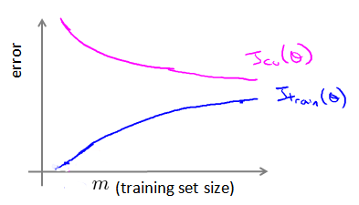

这篇文章跟大家分享一下Machine Learning的学习笔记: 13-应用机器学习的建议(Advice for Applying Machine Learning)。
<!--more-->

# 决定下一步做什么
当我们运用训练好了的模型来预测未知数据的时候发现有较大的误差，我们下一步可以做什么？

+ 获得更多的训练样本——通常是有效的，但代价较大，下面的方法也可能有效，可考虑先采用下面的几种方法。
+ 尝试减少特征的数量
+ 尝试获得更多的特征
+ 尝试增加多项式特征
+ 尝试减少正则化程度\\(\lambda\\)
+ 尝试增加正则化程度\\(\lambda\\)

我这这里将会讨论怎样评估机器学习算法的性能，它们也被称为"机器学习诊断法"。“诊断法”的意思是：这是一种测试法，你通过执行这种测试，能够深入了解某种算法到底是否有用。这通常也能够告诉你，要想改进一种算法的效果，什么样的尝试，才是有意义的。

## 评估一个假设

你该如何判断一个假设函数是过拟合的呢？对于这个简单的例子，我们可以对假设函数\\(h(x)\\)进行画图，然后观察图形趋势，但对于特征变量不止一个的这种一般情况，还有像有很多特征变量的问题，想要通过画出假设函数来进行观察，就会变得很难甚至是不可能实现。 因此，我们需要另一种方法来评估我们的假设函数过拟合检验。 为了检验算法是否过拟合，我们将数据分成训练集和测试集，通常用70%的数据作为训练集，用剩下30%的数据作为测试集。很重要的一点是训练集和测试集均要含有各种类型的数据，通常我们要对数据进行“洗牌”，然后再分成训练集和测试集。

测试集评估在通过训练集让我们的模型学习得出其参数后，对测试集运用该模型，我们有两种方式计算误差：
1. 对于线性回归模型，我们利用测试集数据(Test set)计算代价函数J。
$$
J_{test}(\theta) = \frac{1}{2m_{test}}\sum_{i=1}^{m_{test}}(h_{\theta}(x_{text}^{(i)})-y_{test}^{(i)})^2
$$
2. 对于逻辑回归模型，我们也同样可以使用Test set来计算Cost function J:
$$
J_{test}(\theta) = -\frac{1}{m_{test}}\sum_{i=1}^{m_{test}}(y_{test}^{(i)}log h_\theta(x_{test}^{(i)})+(1-y_{test}^{(i)})log h_\theta(x_{test}^{(i)}))
$$

## 模型选择和训练、交叉验证、测试集

假设我们要在10个不同次数的二项式模型之间进行选择：

显然越高次数的多项式模型越能够适应我们的训练数据集，但是适应训练数据集并不代表着能推广至一般情况，我们应该选择一个更能适应一般情况的模型。我们需要使用交叉验证集来帮助选择模型。 即：使用60%的数据作为训练集，使用20%的数据作为交叉验证集，使用20%的数据作为测试集。

**以上10个不同次数的二项式模型选择的方法为：**
1. 使用训练集训练出10个模型
2. 用10个模型分别对交叉验证集计算得出交叉验证误差（代价函数的值）
3. 选取代价函数值最小的模型
4. 用步骤3中选出的模型对测试集计算得出推广误差（代价函数的值）

**Training error**

$$
J_{train}(\theta) = \frac{1}{2m}\sum_{i=1}^{m}(h_\theta(x^{(i)})-y^{(i)})^2
$$

**Cross Validation error**

$$
J_{cv}(\theta) = \frac{1}{2m_{cv}}\sum_{i=1}^{m_{cv}}(h_\theta(x_{cv}^{(i)})-y_{cv}^{(i)})^2
$$

**Test error**

$$
J_{test}(\theta) = \frac{1}{2m_{test}}\sum_{i=1}^{m_{test}}(h_\theta(x_{test}^{(i)})-y_{test}^{(i)})^2
$$

## 诊断偏差(bias)和方差(variance)

当你运行一个学习算法时，如果这个算法的表现不理想，那么多半是出现两种情况：要么是偏差比较大，要么是方差比较大。换句话说，出现的情况要么是欠拟合，要么是过拟合问题。那么这两种情况，哪个和偏差有关，哪个和方差有关，或者是不是和两个都有关？

我们通常会通过将训练集和交叉验证集的代价函数误差与多项式的次数绘制在同一张图表上来帮助分析：

对于训练集，当d较小时，模型拟合程度更低，误差较大；随着d的增长，拟合程度提高，误差减小。 对于交叉验证集，当d较小时，模型拟合程度低，误差较大；但是随着d的增长，误差呈现先减小后增大的趋势，转折点是我们的模型开始过拟合训练数据集的时候。

## 正则化和偏差、方差
在我们在训练模型的过程中，一般会使用一些正则化方法来防止过拟合。但是我们可能会正则化的程度太高或太小了，即我们在选择λ的值时也需要思考与刚才选择多项式模型次数类似的问题。

我们选择一系列的想要测试的\\(\lambda\\)值，通常是 0-10之间的呈现2倍关系的值（如：0,0.01,0.02,0.04,0.08,0.15,0.32,0.64,1.28,2.56,5.12,10共12个）。 我们同样把数据分为训练集、交叉验证集和测试集。

**选择\\(\lambda\\)的方法为：**

1. 使用训练集训练出12个不同程度正则化的模型
2. 用12个模型分别对交叉验证集计算的出交叉验证误差
3. 选择得出交叉验证误差最小的模型
4. 运用步骤3中选出模型对测试集计算得出推广误差，我们也可以同时将训练集和交叉验证集模型的代价函数误差与λ的值绘制在一张图表上：
5. 当\\(\lambda\\)较小时，训练集误差较小（过拟合）而交叉验证集误差较大; 随着  的增加，训练集误差不断增加（欠拟合），而交叉验证集误差则是先减小后增加

## 学习曲线

学习曲线是学习算法的一个很好的合理检验（sanity check）。学习曲线是将训练集误差和交叉验证集误差作为训练集样本数量（m）的函数绘制的图表。 即，如果我们有100行数据，我们从1行数据开始，逐渐学习更多行的数据。

### 如何利用学习曲线识别**高偏差/欠拟合**
作为例子，我们尝试用一条直线来适应下面的数据，可以看出，无论训练集有多么大误差都不会有太大改观：

也就是说在高偏差/欠拟合的情况下，增加数据到训练集不一定能有帮助。 

### 如何利用学习曲线识别**高方差/过拟合**
假设我们使用一个非常高次的多项式模型，并且正则化非常小，可以看出，当交叉验证集误差远大于训练集误差时，往训练集增加更多数据可以提高模型的效果。

也就是说在高方差/过拟合的情况下，增加更多数据到训练集可能可以提高算法效果。

## 总结

回顾前面中提出的六种可选的下一步，让我们来看一看我们在什么情况下应该怎样选择：

+ 获得更多的训练样本 -- 解决高方差（过拟合）
+ 尝试减少特征的数量 -- 解决高方差（过拟合）
+ 尝试获得更多的特征 -- 解决高偏差（欠拟合）
+ 尝试增加多项式特征 -- 解决高偏差（欠拟合）
+ 尝试减少正则化程度\\(\lambda\\) -- 解决高偏差（欠拟合）
+ 尝试增加正则化程度\\(\lambda\\) -- 解决高方差（过拟合）

### 神经网络和过拟合

使用较小的神经网络，类似于参数较少的情况，容易导致高偏差和欠拟合，但计算代价较小使用较大的神经网络，类似于参数较多的情况，容易导致高方差和过拟合，虽然计算代价比较大，但是可以通过正则化手段来调整而更加适应数据。

**通常选择较大的神经网络并采用正则化处理会比采用较小的神经网络效果要好。** 对于神经网络中的隐藏层的层数的选择，通常从一层开始逐渐增加层数，为了更好地作选择，可以把数据分为训练集、交叉验证集和测试集，针对不同隐藏层层数的神经网络训练神经网络， 然后选择交叉验证集代价最小的神经网络。

# 机器学习系统的设计(Machine Learning System Design)

## 首先要做什么：邮件分类的例子
以一个垃圾邮件分类器算法为例进行讨论。 为了解决这样一个问题，我们首先要做的决定是如何选择并表达特征向量\\(x\\)。我们可以选择一个由100个最常出现在垃圾邮件中的词所构成的列表，根据这些词是否有在邮件中出现，来获得我们的特征向量（出现为1，不出现为0），尺寸为100×1。

为了构建这个分类器算法，我们可以：
+ 收集更多的数据，让我们有更多的垃圾邮件和非垃圾邮件的样本
+ 基于邮件的路由信息开发一系列复杂的特征
+ 基于邮件的正文信息开发一系列复杂的特征，包括考虑截词的处理
+ 为探测刻意的拼写错误（把watch 写成w4tch）开发复杂的算法

在上面这些选项中，非常难决定应该在哪一项上花费时间和精力，作出明智的选择，比随着感觉走要更好。随后讲解的误差分析，会告诉你怎样用一个更加系统性的方法，从一堆不同的方法中，选取合适的那一个。因此，你更有可能选择一个真正的好方法，能让你花上几天几周，甚至是几个月去进行深入的研究。

## 误差分析

误差分析（Error Analysis）会帮助你更系统地做出决定。如果你准备研究机器学习的东西，或者构造机器学习应用程序，最好的实践方法不是建立一个非常复杂的系统，拥有多么复杂的变量；而是构建一个简单的算法，这样你可以很快地实现它。 然后通过交叉验证来检验数据。一旦做完，你可以画出学习曲线，通过画出学习曲线，以及检验误差，来找出你的算法是否有高偏差和高方差的问题，或者别的问题。在这样分析之后，再来决定用更多的数据训练，或者加入更多的特征变量是否有用。

这么做的原因是：这在你刚接触机器学习问题时是一个很好的方法，你并不能提前知道你是否需要复杂的特征变量，或者你是否需要更多的数据，还是别的什么。提前知道你应该做什么，是非常难的，因为你缺少证据，缺少学习曲线。因此，你很难知道你应该把时间花在什么地方来提高算法的表现。但是当你实践一个非常简单即便不完美的方法时，你可以通过画出学习曲线来做出进一步的选择。

除了画出学习曲线之外，一件非常有用的事是误差分析，我的意思是说：当我们在构造垃圾邮件分类器时，我会看一看我的交叉验证数据集，然后亲自看一看哪些邮件被算法错误地分类。因此，通过这些被算法错误分类的垃圾邮件与非垃圾邮件，你可以发现某些系统性的规律：什么类型的邮件总是被错误分类。经常地这样做之后，这个过程能启发你构造新的特征变量，或者告诉你：现在这个系统的短处，然后启发你如何去提高它。

构建一个学习算法的推荐方法为：

1. 从一个简单的能快速实现的算法开始，实现该算法并用交叉验证集数据测试这个算法
2. 绘制学习曲线，决定是增加更多数据，或者添加更多特征，还是其他选择
3. 进行误差分析：人工检查交叉验证集中我们算法中产生预测误差的样本，看看这些样本是否有某种系统化的趋势

## 类偏斜的误差度量
在前面的学习中，我们提到了误差分析，以及设定误差度量值的重要性。那就是，设定某个实数来评估你的学习算法，并衡量它的表现。这里，有一件重要的事情要注意，就是使用一个合适的误差度量值，这有时会对于你的学习算法造成非常微妙的影响，这件重要的事情就是偏斜类（skewed classes）的问题。

类偏斜情况表现为我们的训练集中有非常多的同一种类的样本，只有很少或没有其他类的样本。 例如我们希望用算法来预测癌症是否是恶性的，在我们的训练集中，只有0.5%的实例是恶性肿瘤。假设我们编写一个非学习而来的算法，在所有情况下都预测肿瘤是良性的，那么误差只有0.5%。然而我们通过训练而得到的神经网络算法却有1%的误差。这时，误差的大小是不能视为评判算法效果的依据的。 

我们将算法预测的结果分成四种情况：

$$
Precision(查准率) = \frac{True\ positive}{Predicted\ positive}=\frac{True\ positive}{True\ positive+False\ positive}
$$

$$
Recall(查全率) = \frac{True\ positive}{Actual\ positive}=\frac{True\ positive}{True\ positive+False\ negative}
$$

## 查准率和查全率之间的权衡

之前我们谈到查准率和查全率，作为遇到偏斜类问题的评估度量值。在很多应用中，我们希望能够保证查准率和查全率的相对平衡。 这里将告诉你应该怎么做，同时也向你展示一些查准率和查全率作为算法评估度量值的更有效的方式。继续沿用刚才预测肿瘤性质的例子。

查准率(Precision)=TP/(TP+FP) 例，在所有我们预测有恶性肿瘤的病人中，实际上有恶性肿瘤的病人的百分比，越高越好。

查全率(Recall)=TP/(TP+FN)例，在所有实际上有恶性肿瘤的病人中，成功预测有恶性肿瘤的病人的百分比，越高越好。

如果我们希望只在非常确信的情况下预测为真（肿瘤为恶性），即我们希望更高的查准率，我们可以使用比0.5更大的阀值，如0.7，0.9。这样做我们会减少错误预测病人为恶性肿瘤的情况，同时却会增加未能成功预测肿瘤为恶性的情况。 如果我们希望提高查全率，尽可能地让所有有可能是恶性肿瘤的病人都得到进一步地检查、诊断，我们可以使用比0.5更小的阀值，如0.3。 我们可以将不同阀值情况下，查全率与查准率的关系绘制成图表，曲线的形状根据数据的不同而不同：

如何使用一个参数来判断是否算法更加合理呢？我们可以使用查准率和查全率的平均值，但很多时候并不能给出合理的预期。另一种更加合理的计算方法是计算他们的F1值，起计算公式为：
$$
2\frac{PR}{P+R}
$$

## 机器学习的数据

在之前的一些笔记中，曾经提到我们不要盲目地花大量的时间来收集大量的数据。但事实证明，在一定条件下（后面会提到这些条件是什么），得到大量的数据并在某种类型的学习算法中进行训练，可以是一种有效的方法来获得一个具有良好性能的学习算法。

我们先来看Michele Banko和Eric Brill的研究结果：

通过对比不同的算法我们会发现，随着训练数据集的增大，所有算法的性能也都会对应地增强。 事实上，如果你选择任意一个算法，可能是选择了一个"劣等的"算法，如果你给这个劣等算法更多的数据，那么从这些例子中看起来的话，它看上去很有可能会其他算法更好，甚至会比"优等算法"更好。

结果表明，许多不同的学习算法有时倾向于表现出非常相似的表现。真正能提高性能的，是你能够给一个算法大量的训练数据。像这样的结果，引起了一种在机器学习中的普遍共识："取得成功的人不是拥有最好算法的人，而是拥有最多数据的人"。

那么在什么条件下，更多的数据会提高我们模型的准确度呢？
1. 特征值中有足够的信息来预测y，比如给一个人这些信息，是否可以做出准确预测。
2. 使用的算法中有足够多的参数（比如线性回归或逻辑回归中有很多特征值，或者神经网络中有足够的hidden layer）。
3. 训练集中的数据量足够大。

如果满足以上条件，并且收集到足够多的数据，你大概率会得到一个好性能的算法。