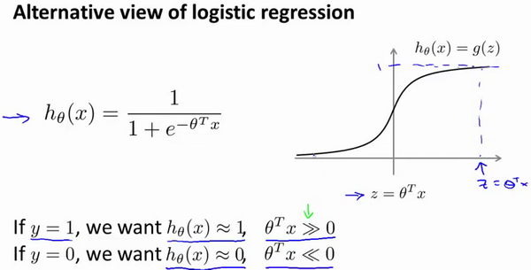

这篇文章跟大家分享一下Machine Learning的学习笔记: 15-支持向量(Support Vector Machines)。
<!--more-->

# 优化目标

与逻辑回归和神经网络相比，支持向量机(Support Vector Machine)，或者简称SVM，在学习复杂的非线性方程时提供了一种更为清晰，更加强大的方式。它也是我们所介绍的最后一个监督学习算法。

为了描述支持向量机，事实上，我将会从逻辑回归开始展示我们如何一点一点修改来得到本质上的支持向量机。

在逻辑回归中我们已经熟悉了这里的假设函数和右边的S型激励函数。简单说来，如果我们有一个y=1的样本，如果我们想要正确的分类，就希望\\(\theta^T x\\)远大于0。相反的，如果我们有另一个样本，y=0，我们就会希望函数输出值接近于0。对应的，\\(\theta^Tx\\)应当远小于0。

下面我们换一种视角来看逻辑回归函数：

在总代价函数中，y=1时，只有左半侧函数起作用；y=0时，只有右半侧函数起作用。

近似的，如果我们用一个新的代价函数来代替，即这条从0点开始的水平直线，然后是一条斜线，像上图。那么，现在让我给这两个方程命名，左边的函数，我称之为\\(cost_1(z)\\)，同时，右边函数我称它为\\(cost_0(z)\\)。这里的下标是指在代价函数中，对应的y=1和y=0 的情况，拥有了这些定义后，现在，我们就开始构建支持向量机。

在逻辑回归中，我们的目标是找到下面这个方程的最小值：
$$
min_\theta\frac{1}{m}[\sum_{i=1}^{m}y^{(i)}(-log h_\theta (x^{(i)}))+(1-y^{(i)})(-log(1-h_\theta (x^{(i)})))]+\frac{\lambda}{2m}\sum_{j=1}^{n}\theta^2
$$

对与支持向量机而言，形式稍微有些不同：
$$
min_\theta C[\sum_{i=1}^{m}y^{(i)}cost_1(\theta^Tx^{(i)})+(1-y^{(i)})cost_0(\theta^Tx^{(i)})]+\frac{1}{2}\sum_{j=1}^{n}\theta^2
$$

对比而言，两个方程有以下不同：
+ 去除了1/m这一项。当然，这只是在不同函数中的不同习惯导致的，1/m项并不会影响取得最优解。
+ 使用\\(C\times A+B\\)来优化参数，而不是使用\\(A+\lambda \times B\\)。当然你也可以把这里的参数\\(C\\)考虑成\\(\frac{1}{\lambda}\\)，\\(C\\)同 \\(\frac{1}{\lambda}\\)所扮演的角色相同。
+ 有别于逻辑回归输出的概率。在这里，支持向量机所做的是它来直接预测的值等于1，还是等于0。

# 大边界的直观理解

人们有时将支持向量机看作是大间距分类器。在这一部分，我将介绍其中的含义，这有助于我们直观理解SVM模型的假设是什么样的。

如果你有一个正样本（y=1)，我们会希望在\\(\theta^Tx \geq 1\\)，而不是仅仅\\(\theta^Tx \geq 0\\)，来使得预测函数为1。反之，如果我们有一个负样本(y=0)，我们希望\(\theta^Tx \leq -1\\)，而不是仅仅\\(\theta^Tx \leq 0\\)，来使得预测函数为0。那么我会就会用到SVM。

SVM相比于逻辑回归函数的以0为分界线来说，选取的边界会大很多，对于样品的分离也更加明显。C值的选择将会影响边界的大小。

在SVM中如果我们将C设置的非常大，决策边界会从黑线变到了粉线，但是如果C设置的小一点，则最终会得到这条黑线。也就是说，当C不是非常大的时候，它可以忽略掉一些异常点的影响，得到更好的决策界。甚至当你的数据不是线性可分的时候，支持向量机也可以给出好的结果。

# Kernels I

回顾我们之前讨论过可以使用高级数的多项式模型来解决无法用直线进行分隔的分类问题：

为了获得上图所示的判定边界，我们的模型可能是\\(\theta_0+\theta_1x_1+\theta_2x_2+\theta_3x_1x_2+\theta_4x_1^2+\theta_5x_2^2+...\\)的形式。

我们可以用一系列的新的特征来替换模型中的每一项。例如令：
$$
f_1=x_1; f_2=x_2; f_3=x_1x_2; f_4=x_1^2; f_5=x_2^2...
$$
从而得到：
$$
h_\theta(x)=\theta_1f_1+\theta_2f_2+...+\theta_nf_n
$$

然而，除了对原有的特征进行组合以外，有没有更好的方法来构造\\(f_1,f_2,f_3...\\)？我们可以用核函数(Kernel)来计算出新的特征。

给定一个训练样本\\(x\\)，我们利用\\(x\\)的各个特征与我们预先选定的地标(landmarks)\\(l^{(1)},l^{(2)},l^{(3)}\\)的近似程度来选取新的特征\\(f_1,f_2,f_3\\)。

例如：\\(f_1=similarity(x,l^{(1)})=e(-\frac{||x-l^{(1)}||}{2\sigma^2})\\)。

其中\\(||x-l^{(1)}||=\sum_{j=1}^n(x_j-l_j^{(1)})^2\\)，为实例x中所有特征与地标\\(l^{(1)}\\)之间的距离的和。其中的\\(f_1=similarity(x,l^{(1)})\\)就是核函数。具体而言，是一个高斯核函数(Gaussian Kernel)。

这些地标的作用是什么？如果一个训练样本\\(x\\)与地标\\(l\\)之间的距离近似于0，则新特征\\(f\\)近似于\\(e^{-0}=1\\)，如果训练样本\\(x\\)与地标\\(l\\)之间距离较远，则\\(f\\)近似于\\(e^{-(一个较大的数)}=0\\)。

假设我们的训练样本含有两个特征值\\([x_1 x_2]\\)，给定地标\\(l^{(1)}\\)与不同的\\(\sigma\\)值：

图中水平面的坐标为\\(x_1,x_2\\)，而垂直坐标轴代表\\(f\\)。可以看出，只有当\\(x\\)与\\(l^{(1)}\\)重合时才具有最大值。随着的改变值改变的速率受到\\(\sigma^2\\)的控制。

在下图中，当样本处于洋红色的点位置处，因为其离\\(l^{(1)}\\)更近，但是离\\(l^{(2)}\\)和\\(l^{(3)}\\)较远，因此\\(f_1\\)接近1，而\\(f_2\\),\\(f_3\\)接近0。因此\\(h_\theta(x)=\theta_0+\theta_1f_1+\theta_2f_2+\theta_3f_3>0\\)，因此预测\\(y=1\\)。同理可以求出，对于离\\(l^{(2)}\\)较近的绿色点，也预测\\(y=1\\)，但是对于蓝绿色的点，因为其离三个地标都较远，预测\\(y=0\\)。

# Kernels II

## 如何选择地标？

我们通常是根据训练集的数量选择地标的数量，即如果训练集中有m个样本，则我们选取m个地标，并且令:\\(l^{(1)}=x^{(1)}, l^{(2)}=x^{(2)}, l^{(3)}=x^{(3)}...l^{(m)}=x^{(m)}\\)。这样做的好处在于：现在我们得到的新特征是建立在原有特征与训练集中所有其他特征之间距离的基础之上的。

## 向量机中使用核函数

下面我们将核函数运用到支持向量机中，修改我们的支持向量机假设为：
给定\\(x\\)，计算新的特征\\(f\\)，当\\(\theta^T gte 0\\)时，预测\\(y=1\\)，否则反之。

相应的修改代价函数为：
$$
min_\theta C\sum_{i=1}^{m}y^{(i)}cost_1(\theta^Tf^{(i)})+(1-y^{(i)})cost_0(\theta^Tf^{(i)})+\frac{1}{2}\sum_{j=1}^{m}\theta_j^2
$$

在具体实施过程中，我们还需要对最后的正则化项进行些微调整。在计算时，我们用\\(\theta^TM\theta\\)代替\\(\theta^T\theta\\)，M其中是根据我们选择的核函数而不同的一个矩阵。这样做的原因是为了简化计算。

理论上讲，我们也可以在逻辑回归中使用核函数，但是上面使用M来简化计算的方法不适用与逻辑回归，因此计算将非常耗费时间。

另外，支持向量机也可以不使用核函数，不使用核函数又称为线性核函数(linear kernel)，当我们不采用非常复杂的函数，或者我们的训练集特征非常多而样本非常少的时候，可以采用这种不带核函数的支持向量机。

下面是支持向量机的两个参数\\(C\\)和\\(\sigma\\)的影响：

\\(C=\frac{1}{\lambda}\\)

\\(C\\)较大时，相当于\\(\lambda\\)较小，会导致过拟合，高方差；

\\(C\\)较小时，相当于\\(\lambda\\)较大，会导致低拟合，高偏差；

\\(\sigma\\)较大时，可能会导致低方差，高偏差；

\\(\sigma\\)较小时，可能会导致低偏差，高方差。

# 使用支持向量机

推荐使用SVM软件包来求解参数\\(\theta\\)，用的比较多的两个包为：liblinear和libsvm。除了高斯核函数之外，我们还有其他一些选择，例如：

+ 多项式核函数(Polynomial Kernel)
+ 字符串核函数(String Kernel)
+ 卡方核函数(chi-square Kernel)
+ 直方图交集核函数(histogram intersection kernel)

假设我们利用之前介绍的一对多方法来解决一个多类分类问题。如果一共有k个类，则我们需要k个模型，以及k个参数向量。我们同样也可以训练k个支持向量机来解决多类分类问题。但是大多数支持向量机软件包都有内置的多类分类功能，我们只要直接使用即可。

尽管你不去写你自己的SVM的优化软件，但是你也需要做几件事：
+ 提出参数C的选择。
+ 选择内核参数或想要使用的相似函数。其中一个选择是：我们选择不需要任何内核参数，没有内核参数的理念，也叫线性核函数。因此，如果有人说他使用了线性核的SVM（支持向量机），这就意味这他使用了不带有核函数的SVM（支持向量机）。

## 逻辑回归模型 vs. 支持向量机模型

从逻辑回归模型，我们得到了支持向量机模型，在两者之间，我们应该如何选择呢？

下面是一些普遍使用的准则：
n为特征数，m为训练样本数。

(1)如果相较于m而言，n要大许多，即训练集数据量不够支持我们训练一个复杂的非线性模型，我们选用逻辑回归模型或者不带核函数的支持向量机。

(2)如果n较小，而且m大小中等，例如n在 1-1000 之间，而m在10-10000之间，使用高斯核函数的支持向量机。

(3)如果n较小，而m较大，例如n在1-1000之间，而m大于50000，则使用支持向量机会非常慢，解决方案是创造、增加更多的特征，然后使用逻辑回归或不带核函数的支持向量机。

值得一提的是，神经网络在以上三种情况下都可能会有较好的表现，但是训练神经网络可能非常慢，选择支持向量机的原因主要在于它的代价函数是凸函数，不存在局部最小值。