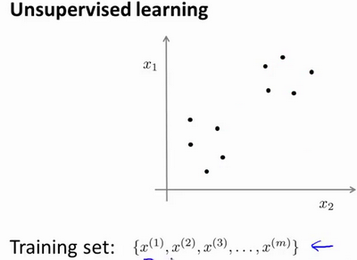
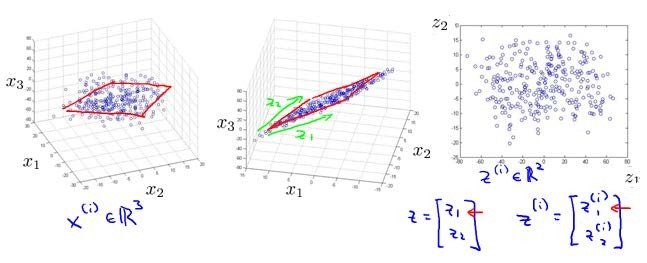
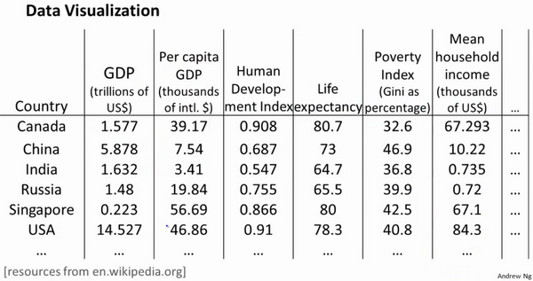

这篇文章跟大家分享一下Machine Learning的学习笔记: 17-无监督学习(Unsupervised Learning)。
<!--more-->

# 聚类(Clustering)
## 无监督学习-简介
在一个典型的监督学习中，我们有一个有标签的训练集，我们的目标是找到能够区分正样本和负样本的决策边界。与此不同的是，在非监督学习中，我们的数据没有附带任何标签，我们拿到的数据就是这样的：



在这个例子中，我们没有任何标签y。也就是说，在非监督学习中，我们需要将一系列无标签的训练数据，输入到一个算法中，然后我们告诉这个算法，去为我们找找这个数据的内在结构给定数据。

图上的数据看起来可以分成两个分开的点集（称为簇），一个能够找到我圈出的这些点集的算法，就被称为聚类算法。

那么聚类算法一般用来做什么呢？


在这门课程的早些时候，我曾经列举过一些应用：比如市场分割。也许你在数据库中存储了许多客户的信息，而你希望将他们分成不同的客户群，这样你可以对不同类型的客户分别销售产品或者分别提供更适合的服务。社交网络分析：事实上有许多研究人员正在研究这样一些内容，他们关注一群人，关注社交网络，例如Facebook，Google+，或者是其他的一些信息，比如说：你经常跟哪些人联系，而这些人又经常给哪些人发邮件，由此找到关系密切的人群。另外，聚类算法可以用来更好的组织计算机集群，或者更好的管理数据中心。因为如果你知道数据中心中，哪些计算机经常协作工作。那么，你可以重新分配资源，重新布局网络。由此优化数据中心，优化数据通信。

## k-均值算法

K-均值是最普及的聚类算法，算法接受一个未标记的数据集，然后将数据聚类成不同的组。

假设我们想要将数据聚类成K个组，其方法为:
+ 首先，选择K个随机的点，称为聚类中心（cluster centroids）
+ 对于数据集中的每一个数据，按照距离K个中心点的距离，将其与距离最近的中心点关联起来，与同一个中心点关联的所有点聚成一类
+ 计算每一个组的平均值，将该组所关联的中心点移动到平均值的位置
+ 重复步骤2-4直至中心点不再变化

用\\(\mu^1,\mu^2,...,\mu^k\\)来表示聚类中心，用\\(c^{(1)},c^{(2)},c^{(3)},...,c^{(m)}\\)来存储与第i个实例数据最接近的聚类中心索引，K-均值的迭代算法代码如下：
```
Repeat {

for i = 1 to m

    c(i) := index (form 1 to K) of cluster centroid closest to x(i)

for k = 1 to K

    μk := average (mean) of points assigned to cluster k

}
```
算法分为两个步骤:1)第一个for循环用于分配样例i所属的类；2)第二个for循环用于移动聚类中心，即：对于每一个类K，重新计算该类的质心。

K-均值算法也可以很便利地用于将数据分为许多不同组，即使在没有非常明显区分的组群的情况下也可以。下图所示的数据集包含身高和体重两项特征构成的，利用K-均值算法将数据分为三类，用于帮助确定将要生产的T-恤衫的三种尺寸。


## 优化目标
K-均值最小化问题，是要最小化所有的数据点与其所关联的聚类中心点之间的距离之和，因此 K-均值的代价函数（又称畸变函数 Distortion function）为：

$$
J(c^{(1)},...,c^{(m)},\mu^1,...,\mu^k) = \frac{1}{m}\sum_{i=1}^{m}||X^{(i)}-\mu_{c^{(i)}}||^2
$$

其中\\(\mu_{c^{(i)}}\\)代表与\\(x^{(i)}\\)最近的聚类中心点。

回顾刚才给出的: K-均值迭代算法，我们知道，第一个循环是用于减小\\(c^{(i)}\\)引起的代价，而第二个循环则是用于减小\\(\mu_i\\)引起的代价。迭代的过程一定会是每一次迭代都在减小代价函数，不然便是出现了错误。

## 随机初始化

在运行K-均值算法的之前，我们首先要按照如下步骤随机初始化所有的聚类中心点：
+ 我们应该选择K < m, 即聚类中心点的个数要小于所有训练集实例的数量
+ 随机选择K个训练实例，然后令K个聚类中心分别与这K个训练实例相等

K-均值的一个问题在于，它有可能会停留在一个局部最小值处。

为了解决这个问题，我们通常需要多次运行K-均值算法，每一次都重新进行随机初始化，最后再比较多次运行K-均值的结果，选择代价函数最小的结果。这种方法在K较小的时候（2--10）还是可行的，但是如果K较大，这么做也可能不会有明显地改善。

## 选择聚类数

首先要明白一个概念，没有所谓最好的选择聚类数的方法。我们通常是根据不同的问题，人工进行选择不同的聚类数。选择的时候思考我们运用K-均值算法聚类的动机是什么，然后选择能最好服务于该目的标聚类数。

选择聚类数目的方法时，有一个可能会谈及的方法叫作“肘部法则”。关于“肘部法则”，我们所需要做的是改变K值，也就是聚类类别数目的总数。然后，计算成本函数J。


我们可能会得到一条类似于这样一个像人的肘部的曲线。你会发现随着K值增加，它的陈本函数J会迅速下降，并且在3的时候达到一个肘点。在此之后，J值就下降的非常慢，那么我们就选K=3。当你应用“肘部法则”的时候，如果你得到了一个像上面这样的图，那么这将是一种用来选择聚类个数的合理方法。

当大部分的时候，我们会得到一条如右图所示的曲线，这时候，我们就不能从这条曲线得出合理的聚类数。这时候，我们就应该选择其他的方法来选择聚类数。

例如，我们的T-恤制造例子中，人们身高和体重数据是一些连续分布的点，我们就无法使用肘部曲线来进行分类。而是要根据我们的需求分类，比如，我们可以分成3个尺寸:S,M,L，也可以分成5个尺寸:XS,S,M,L,XL。这样的选择是建立在回答“聚类后我们制造的T-恤是否能较好地适合我们的客户”这个问题的基础上作出的。


# 降维(Dimensionality Reduction)

## 动机一：数据压缩

有几个不同的的原因使你可能想要做降维。一是数据压缩，数据压缩不仅允许我们使用较少的计算机内存或磁盘空间，它也能够使我们的算法计算速度更快。

例如，我们未知两个的特征：\\(x_1\\)长度：用厘米表示；\\(x_2\\)：是用英寸表示同一物体的长度。我们就可以将数据减小到一个维度。


类似的，在实际的工业运用中，有时可能有几个不同的工程团队，也许一个工程队给你二百个特征，第二工程队给你另外三百个的特征，第三工程队给你五百个特征，一千多个特征都在一起，它实际上会变得非常困难去追踪这些特征。这时，我们就需要将特征进行降维，从而更加容易的追踪它们。

**将数据从三维降至二维**： 这个例子中我们要将一个三维的特征向量降至一个二维的特征向量。过程是与上面类似的，我们将三维向量投射到一个二维的平面上，迫使所有的数据都在同一个平面上，从而降至二维的特征向量。



我们可以将这样的处理过程应用于任何维度的数据，从而降到任何想要的维度，例如将1000维的特征降至100维。

## 动机二：数据可视化

在许多及其学习问题中，如果我们能将数据可视化，我们便能寻找到一个更好的解决方案。这时候，降维便可以帮助我们。



假使我们有有关于许多不同国家的数据，每一个特征向量都有50个特征（如GDP，人均GDP，平均寿命等）。如果要将这个50维的数据可视化是不可能的。使用降维的方法将其降至2维，我们便可以将其可视化了。


这样做的问题在于，降维的算法只负责减少维数，新产生的特征的意义就必须由我们自己去发现了。

## 主成分分析问题(Principal Component Analysis Problem Formulation)

主成分分析(PCA)是最常见的降维算法。在PCA中，我们要做的是找到一个方向向量（Vector direction），当我们把所有的数据都投射到该向量上时，我们希望投射平均均方误差能尽可能地小。方向向量是一个经过原点的向量，而投射误差是从特征向量向该方向向量作垂线的长度。

PCA技术的一大好处是对数据进行降维的处理。我们可以对新求出的“主元”向量的重要性进行排序，根据需要取前面最重要的部分，将后面的维数省去，可以达到降维从而简化模型或是对数据进行压缩的效果。同时最大程度的保持了原有数据的信息。

## 主成分分析算法(Principal Component Analysis Algorithm)

PCA将n维数据降维到k维的步骤：
+ 均值归一化：我们需要计算出所有特征的均值，然后令\\(x_j=x_j-\mu_j\\)。如果特征是在不同的数量级上，我们还需要将其除以标准差\\(\sigma^2\\)。
+ 计算协方差矩阵(covariance matrix)。\\(\sum = \frac{1}{m}\sum_{i=1}^{n}(x^{(i)})(x^{(i)})^T\\)。
+ 计算协方差矩阵(covariance matrix)\\(\sum\\)的特征向量(eigenvectors)：
    * 在Octave中可以利用奇异值分解(singular value decomposition)来求解
    * 其函数为[U,S,V]=svd(sigma)

对于一个\\(n\times n\\)维度的矩阵，上式中的U是一个具有与数据之间最小投射误差的方向向量构成的矩阵。如果我们希望将数据从n维降至k维，我们只需要从U中选取前k个向量，从而获得一个\\(n\times k\\)维度的矩阵，我们用\\(U_{reduce}\\)来表示，然后通过如下计算获得新的特征向量\\(z^{(i)}\\)：
$$
z^{(i)} = U_{reduce}^T * x^{(i)}
$$

## 选择主成分的数量(Choosing the Number of Principal Components)


**我们希望在平均均方误差与训练集方差的比例尽可能小的情况下选择尽可能小的k值**。

投射的平均均方误差：\\(\frac{1}{m}\sum_{i=1}^{m}||x^{(i)}-x_{approx}^{(i)}||^2\\)

训练集的方差为:\\(\frac{1}{m}\sum_{i=1}^{m}||x^{(i)}||^2\\)

如果我们希望这个比例小于1%，就意味着原本数据的偏差有99%都保留下来了。

我们可以先令\\(k=1\\)，然后进行主要成分分析，获得\\(U_{reduce}\\)和\\(z\\)，然后计算比例是否小于1%。如果不是的话再令\\(k=2\\)，如此类推，直到找到可以使得比例小于1%的最小k值。

我们还可以使用Octave的svd函数([U, S, V] = svd(sigma))中的返回的第二个参数S来快速的得到k值。

这里S是一个\\(n\times n\\)的矩阵，只有对角线上有值，而其它单元都是0。


计算平均均方误差与训练集方差的比例的方法如下：
$$
\frac{\frac{1}{m}\sum_{i=1}^{m}||x^{(i)}-x_{approx}^{(i)}||^2\}{\frac{1}{m}\sum_{i=1}^{m}||x^{(i)}||^2}=1-\frac{\sum_{i=1}{k}S_{ii}}{\sum_{i=1}{m}S_{ii}} \leq 1%
$$

在压缩过数据后，我们可以采用如下方法来近似地获得原有的特征：\\(x_{approax}^{(i)}=U_{reduce}z^{(i)}\\)

## 主成分分析法的应用建议(Advice for Applying PCA)

假使我们正在针对一张 100×100像素的图片进行某个计算机视觉的机器学习，即总共有10000 个特征。
1. 第一步是运用主要成分分析将数据压缩至1000个特征
2. 然后对训练集运行学习算法
3. 在预测时，采用之前学习而来的\\(U_{reduce}\\)将输入的特征\\(x\\)转换成特征向量\\(z\\)，然后再进行预测

**错误的主要成分分析情况**：
+ 用于减少过拟合--原因在于主要成分分析只是近似地丢弃掉一些特征，它并不考虑任何与结果变量有关的信息，因此可能会丢失非常重要的特征。
+ 默认地将主要成分分析作为学习过程中的一部分--这虽然很多时候有效果，最好还是从所有原始特征开始，只在有必要的时候（算法运行太慢或者占用太多内存）才考虑采用主要成分分析。