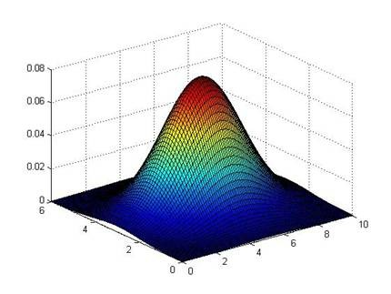

这篇文章跟大家分享一下Machine Learning的学习笔记: 19-异常检测(Anomaly Detection)。
<!--more-->

# 问题的动机

## 什么是异常检测？

异常检测(Anomaly Detection)问题是机器学习算法的一个常见的应用。这种算法的一个有趣之处在于：它虽然主要用于非监督学习问题，但从某些角度看，它又类似于一些监督学习问题。

我们来举例说明：

假想你是一个飞机引擎制造商，当你生产的飞机引擎从生产线上流出时，你需要进行QA(质量控制测试)，而作为这个测试的一部分，你测量了飞机引擎的一些特征变量，比如引擎运转时产生的热量，或者引擎的振动等等。这样一来，你就有了一个数据集，从\\(x^{(1)}\\)到\\(x^{(m)}\\)，你将这些数据绘制成图表，看起来就是这个样子：

这里的每个数据点都是无标签的数据。异常检测问题可以定义如下：我们假设后来有一天，你有一个新的飞机引擎从生产线上流出，而你的新飞机引擎有特征变量\\(x_{test}\\)。我们希望通过对现有数据的分析知道这个新的飞机引擎是否有某种异常，而不需要进一步的测试。

假使给定的数据集\\(x^{(1)},x^{(2)},...x^{(m)}\\)是正常的，我们需要知道新的数据\\(x_{test}\\)是不是正常的。我们可以把这个问题转化为测试该数据不属于给定数据集的几率如何。我们所构建的模型应该能根据该测试数据的位置告诉我们其属于一组数据的概率\\(p(x)\\)。

上图中，在蓝色圈内的数据属于该组数据的可能性较高，而越是偏远的数据，其属于该组数据的可能性就越低。这种方法称为密度估计，表达如下：

$$ 
if\ \ p(x)
\begin{cases}
< & \epsilon & anomaly \\\\
\geq & \epsilon & normal
\end{cases}
$$

## 异常检测例子

### 欺诈检测

异常检测主要用来识别欺骗。例如在线采集而来的有关用户的数据，一个特征向量中可能会包含如：用户多久登录一次，访问过的页面，在论坛发布的帖子数量，甚至是打字速度等。尝试根据这些特征构建一个模型，可以用这个模型来识别那些不符合该模式的用户。

+ 通过建模来计算\\(p(x)\\)
+ 检测\\(p(x)<\epsilon\\)来确定非正常用户。

### 生产制造残次品检测

例如我们上面提到的飞机引擎的例子

### 数据中心监测

再一个例子是检测一个数据中心，特征可能包含：内存使用情况，被访问的磁盘数量，CPU的负载，网络的通信量等。根据这些特征可以构建一个模型，用来判断某些计算机是不是有可能出错了。

# 高斯分布

高斯分布，也称为正态分布。先回顾以下高斯分布的基本知识：

通常如果我们认为变量\\(x\\)符合高斯分布\\(x~N(\mu, \sigma^2)\\)则其概率密度函数为： 
$$
p(x;\mu,\sigma^2)=\frac{1}{\sqrt{2\pi}\sigma}exp(-\frac{(x-\mu)^2}{2\sigma^2})
$$

我们可以利用已有的数据来预测总体中的\\(\mu\\)和\\(\sigma^2\\),计算方法如下： 

$$
\mu = \frac{1}{m}\sum_{i=1}^{m}x^{(i)}
$$

$$
\sigma^2 = \frac{1}{m}\sum_{i=1}^{m}(x^{(i)}-\mu)^2
$$

注：机器学习中对于方差我们通常只除以m而非统计学中的(m-1)。这两个版本的公式在理论特性和数学特性上稍有不同，但是在实际使用中，他们的区别甚小，几乎可以忽略不计。

# 算法

## 异常检测算法
对于给定的数据集\\(x^{(1)},x^{(2)},...x^{(m)}\\)，我们要针对每一个特征计算\\(\mu\\)和\\(\sigma^2\\)的估计值。
$$
\mu = \frac{1}{m}\sum_{i=1}^{m}x_j^{(i)}
$$

$$
\sigma^2 = \frac{1}{m}\sum_{i=1}^{m}(x_j^{(i)}-\mu_j)^2
$$

一旦我们获得了平均值和方差的估计值，给定新的一个训练实例，根据模型计算\\(p(x)\\)：
$$
p(x) = \Pi_{j=1}^{n}p(x_j;\mu_j,\sigma^2)=\Pi_{j=1}^{1}\frac{1}{\sqrt{2\pi}\sigma_j}exp(-\frac{(x_j-\mu_j)^2}{2\sigma_j^2})
$$

当\\(p(x) < \epsilon\\)时为异常。

例如下图是一个由两个特征的训练集，以及特征的分布情况：

下面的三维图表表示的是密度估计函数，z轴为根据两个特征的值所估计的\\(p(x)\\)值：

我们需要选择一个\\(\epsilon\\)，将\\(p(x)=\epsilon\\)作为我们的判定边界，当时预测数据\\(p(x)>\epsilon\\)为正常数据，否则为异常。

## 开发和评价一个异常检测系统

异常检测算法是一个非监督学习算法，意味着我们无法根据结果变量y的值来告诉我们数据是否真的是异常的。我们需要另一种方法来帮助检验算法是否有效。

当我们开发一个异常检测系统时，我们从带标记（异常或正常）的数据着手，我们从其中选择一部分正常数据用于构建训练集，然后用剩下的正常数据和异常数据混合的数据构成交叉检验集和测试集。

例如：我们有10000台正常引擎的数据，有20台异常引擎的数据。 我们这样分配数据：

+ 6000台正常引擎的数据作为训练集

+ 2000台正常引擎和10台异常引擎的数据作为交叉检验集

+ 2000台正常引擎和10台异常引擎的数据作为测试集

具体的评价方法如下：

+ 根据测试集数据，我们估计特征的平均值和方差并构建\\(p(x)\\)函数
+ 对交叉检验集，我们尝试使用不同的\\(\epsilon\\)值作为阀值，并预测数据是否异常，根据F1值或者查准率与查全率的比例来选择 \\(\epsilon\\)
+ 选出\\(\epsilon\\)后，针对测试集进行预测，计算异常检验系统的F1值，或者查准率与查全率之比

# 异常检测与监督学习对比

之前我们构建的异常检测系统也使用了带标记的数据，与监督学习有些相似，下面的对比有助于选择采用监督学习还是异常检测。

|异常检测|监督学习|
|-----|-----|
|非常少量的正向类（异常数据y=1）, 大量的负向类（y=0）|同时有大量的正向类和负向类|
|许多不同种类的异常。对于任何算法来说，根据非常少量的正向类数据来进行训练什么是异常都是非常困难的|有足够多的正向类实例，足够用于训练 算法，未来遇到的正向类实例可能与训练集中的非常近似|
|未来遇到的异常可能与已掌握的异常、非常的不同|    |
|例如： 欺诈行为检测 生产（例如飞机引擎）检测数据中心的计算机运行状况|例如：邮件过滤器 天气预报 肿瘤分类|

# 选择特征
对于异常检测算法，我们使用的特征是至关重要的，下面谈谈如何选择特征：

## 高斯分布转换

异常检测假设特征符合高斯分布，如果数据的分布不是高斯分布，异常检测算法也能够工作，但是最好还是将数据转换成高斯分布。

例如使用对数函数：\\(x=log(x+c)\\)，其中\\(c\\)为非负常数； 或者\\(x=x^c\\)，\\(c\\)为 0-1 之间的一个分数，等方法。

## 误差分析

我们异常检测系统希望得到的结果:
+ 对于正常样品，我们希望获得较大的p(x)值
+ 对于异常样品，我们希望获得较小的p(x)值

但在异常检测问题中一个常见的问题就是，对于正常和异常样品，我们获得的p(x)值比较接近，从而无法真正把异常样品挑选出来。

我们通常可以通过将一些相关的特征进行组合，来获得一些新的更好的特征（异常数据的该特征值异常地大或小），例如，在检测数据中心的计算机状况的例子中，我们可以用CPU负载与网络通信量的比例作为一个新的特征，如果该值异常地大，便有可能意味着该服务器是陷入了一些问题中。

# 多元高斯分布

假使我们有两个相关的特征，而且这两个特征的值域范围比较宽，这种情况下，一般的高斯分布模型可能不能很好地识别异常数据。其原因在于，一般的高斯分布模型尝试的是去同时抓住两个特征的偏差，因此创造出一个比较大的判定边界。

下图中是两个相关特征，洋红色的线（根据ε的不同其范围可大可小）是一般的高斯分布模型获得的判定边界，很明显绿色的X所代表的数据点很可能是异常值，但是其p(x)值却仍然在正常范围内。多元高斯分布将创建像图中蓝色曲线所示的判定边界。

在一般的高斯分布模型中，我们计算p(x)的方法是： 通过分别计算每个特征对应的几率然后将其累乘起来，在多元高斯分布模型中，我们将构建特征的协方差矩阵，用所有的特征一起来计算p(x)。

$$
\mu=\frac{1}{m}\sum_{i=1}^{m}x^{(i)}
$$
$$
\Sigma = \frac{1}{m}(x^{(i)}-\mu)(x^{(i)}-\mu)^T=\frac{1}{m}(X-\mu)^T(X-\mu)
$$

其中，\\(\mu\\)是一个向量，其每一个单元都是原特征矩阵中一行数据的均值。

最后我们计算多元高斯分布的p(x):
$$
p(x;\mu,\Sigma)=\frac{1}{(2\pi)^{n/2}|\Sigma|^{1/2}}exp(-\frac{1}{2}(x-\mu)^T\Sigma^{-1}(x-\mu))
$$

其中\\(|\Sigma|\\)是定矩阵，在Octave中用det(sigma)计算。

下面我们来看看协方差矩阵是如何影响模型的：

上图是5个不同的模型，从左往右依次分析：

1. 是一个一般的高斯分布模型
2. 通过协方差矩阵，令特征1拥有较小的偏差，同时保持特征2的偏差
3. 通过协方差矩阵，令特征2拥有较大的偏差，同时保持特征1的偏差
4. 通过协方差矩阵，在不改变两个特征的原有偏差的基础上，增加两者之间的正相关性
5. 通过协方差矩阵，在不改变两个特征的原有偏差的基础上，增加两者之间的负相关性

## 原高斯分布模型和多元高斯分布模型的比较：

|原高斯分布模型|多元高斯分布模型|
|-----|-----|
|不能捕捉特征之间的相关性 但可以通过将特征进行组合的方法来解决|自动捕捉特征之间的相关性|
|计算代价低，能适应大规模的特征|计算代价较高；训练集较小时也同样适用|
|m较小的情况也可以使用|必须要有m>n，不然的话协方差矩阵不可逆，通常需要m>10n另外特征冗余也会导致协方差矩阵不可逆|