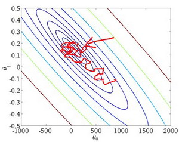
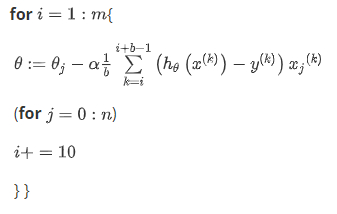
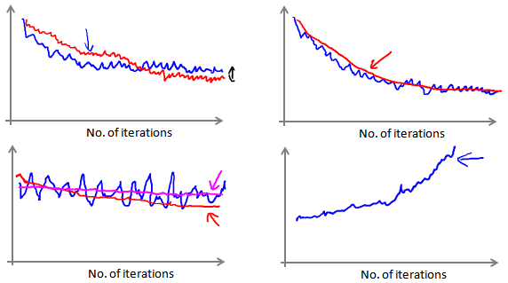
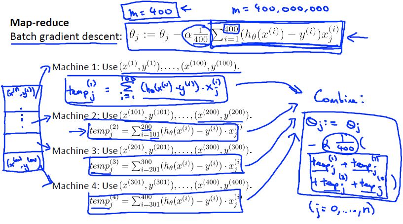

这篇文章跟大家分享一下Machine Learning的学习笔记: 22-大规模机器学习(Large Scale Machine Learning)。
<!--more-->
# 大型数据集的学习
如果我们有一个低方差的模型，增加数据集的规模可以帮助你获得更好的结果。我们应该怎样应对一个有100万条记录的训练集？

以线性回归模型为例，每一次梯度下降迭代，我们都需要计算这100万条记录的误差的平方和，如果我们的学习算法需要有20次迭代，这便已经是非常大的计算代价。

所以，我们首先应该做的事是去检查一个这么大规模的训练集是否真的必要，也许我们只用1000个训练集也能获得较好的效果，我们可以绘制学习曲线来帮助判断。


# 随机梯度下降法(Stochastic gradient descent)

如果我们一定需要一个大规模的训练集，我们可以尝试使用随机梯度下降法(Stochastic gradient descent)来代替批量梯度下降法。

在随机梯度下降法中，我们定义代价函数为一个单一训练实例的代价：

$$
cost(\theta,(x^{(i)},y^{(i)})) = \frac{1}{2}(h_\theta(x^{(i)})-y^{(i)})^2
$$
随机梯度下降算法为：
+ 对训练集随机“洗牌”
+ 重复以下循环1到10次：
```
Repeat{
  for i=1:m{ 
    theta := theta_j - alpha(h_theta(x_i)-y_i)
    (for j = 0:n)
  }
}
```
随机梯度下降算法在每一次计算之后便更新参数\\(\theta\\)，而不需要首先将所有的训练集求和，在梯度下降算法还没有完成一次迭代时，随机梯度下降算法便已经走出了很远。但是这样的算法存在的问题是，不是每一步都是朝着”正确”的方向迈出的。因此算法虽然会逐渐走向全局最小值的位置，但是可能无法站到那个最小值的那一点，而是在最小值点附近徘徊。



# 小批量梯度下降(Mini-batch gradient descent)

小批量梯度下降算法是介于批量梯度下降算法和随机梯度下降算法之间的算法，每计算常数b次训练实例，便更新一次参数\\(\theta\\)。

Repeat{



通常我们会令b在 2-100 之间。这样做的好处在于，我们可以用向量化的方式来循环b个训练实例，如果我们用的线性代数函数库比较好，能够支持平行处理，那么算法的总体表现将不受影响（与随机梯度下降相同）。

# 随机梯度下降收敛(Stochastic gradient descent convergence)

在批量梯度下降中，我们可以令代价函数J为迭代次数的函数，绘制图表，根据图表来判断梯度下降是否收敛。但是，在大规模的训练集的情况下，这是不现实的，因为计算代价太大了。

在随机梯度下降中，我们在每一次更新\\(\theta\\)之前都计算一次代价，然后每x次迭代后，求出这x次对训练实例计算代价的平均值，然后绘制这些平均值与x次迭代的次数之间的函数图表。



当我们绘制这样的图表时，可能会得到一个颠簸不平但是不会明显减少的函数图像（如上面左下图中蓝线所示）。我们可以增加\\(\alpha\\)来使得函数更加平缓，也许便能看出下降的趋势了（如上面左下图中红线所示）；或者可能函数图表仍然是颠簸不平且不下降的（如洋红色线所示），那么我们的模型本身可能存在一些错误。

如果我们得到的曲线如上面右下方所示，不断地上升，那么说明我们选择的\\(\alpha\\)太大，我们可能会需要选择一个较小的学习率\\(\alpha\\)。

我们也可以令学习率随着迭代次数的增加而减小，例如令：

$$
\alpha=\frac{const1}{iterationNumber + const2}
$$

随着我们不断地靠近全局最小值，通过减小学习率，我们迫使算法收敛而非在最小值附近徘徊。 但是通常我们不需要这样做便能有非常好的效果了，对\\(alpha\\)进行调整所耗费的计算通常不值得。


# 在线学习(Online learning)

如果你有一个由连续的用户流引发的连续的数据流，进入你的网站，你能做的是使用一个在线学习机制，从数据流中学习用户的偏好，然后使用这些信息来优化一些关于网站的决策。

许多在线网站都有持续不断的用户流，对于每一个用户，网站希望能在不将数据存储到数据库中便顺利地进行算法学习。

假使我们正在经营一家物流公司，每当一个用户询问从地点A至地点B的快递费用时，我们给用户一个报价，该用户可能选择接受（y=1）或不接受（y=0）。

现在，我们希望构建一个模型，来预测用户接受报价使用我们的物流服务的可能性。因此报价 是我们的一个特征，其他特征为距离，起始地点，目标地点以及特定的用户数据。模型的输出是:\\(p(y=1)\\)。

在线学习的算法与随机梯度下降算法有些类似，我们对单一的实例进行学习，而非对一个提前定义的训练集进行循环。

```
Repeat forever (as long as the website is running) {

  Get (x,y) corresponding to the current user

  theta := theta_j- alpha(h_theta(x)-y)
  (for j=0:n)

}
```

一旦对一个数据的学习完成了，我们便可以丢弃该数据，不需要再存储它了。这种方式的好处在于，我们的算法可以很好的适应用户的倾向性，算法可以针对用户的当前行为不断地更新模型以适应该用户。

每次交互事件并不只产生一个数据集，例如，我们一次给用户提供3个物流选项，用户选择2项，我们实际上可以获得3个新的训练实例，因而我们的算法可以一次从3个实例中学习并更新模型。

我们所使用的这个算法与随机梯度下降算法非常类似，唯一的区别的是，我们不会使用一个固定的数据集，我们会做的是获取一个用户样本，从那个样本中学习，然后丢弃那个样本并继续下去。尤其是，如果你对某一种应用有一个连续的数据流，这样的算法会非常值得认真考虑。在线学习的一个优点就是，如果你有一个变化的用户群，又或者你在尝试预测的事情，在缓慢变化 （就像你的用户的品味在缓慢变化），在线学习算法，可以慢慢地调试你所学习到的假设，将其调节更新到最新的用户行为。

# 映射化简和数据并行(Map-reduce and data parallelism)

映射化简和数据并行对于大规模机器学习问题而言是非常重要的概念。之前提到，如果我们用批量梯度下降算法来求解大规模数据集的最优解，我们需要对整个训练集进行循环，计算偏导数和代价，再求和，计算代价非常大。如果我们能够将我们的数据集分配给不多台计算机，让每一台计算机处理数据集的一个子集，然后我们将计所的结果汇总在求和。这样的方法叫做映射简化。

具体而言，如果任何学习算法能够表达为，对训练集的函数的求和，那么便能将这个任务分配给多台计算机（或者同一台计算机的不同CPU 核心），以达到加速处理的目的。

例如，我们有400个训练实例，我们可以将批量梯度下降的求和任务分配给4台计算机进行处理：



很多高级的线性代数函数库已经能够利用多核CPU的多个核心来并行地处理矩阵运算，这也是算法的向量化实现如此重要的缘故（比调用循环快）。

