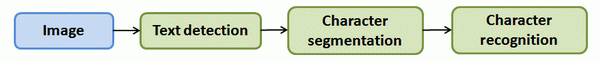
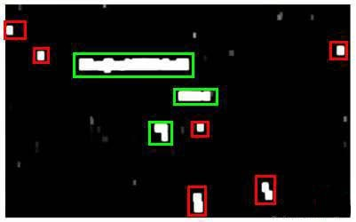
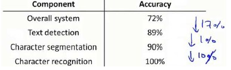

这篇文章跟大家分享一下Machine Learning的学习笔记: 22-应用实例：图片文字识别(Application example:Photo OCR)。
<!--more-->

# 问题描述和流程图(Problem description and pipeline)

图像文字识别应用所作的事是，从一张给定的图片中识别文字。这比从一份扫描文档中识别文字要复杂的多。

为了完成这样的工作，需要采取如下步骤：

+ 文字侦测（Text detection）——将图片上的文字与其他环境对象分离开来
+ 字符切分（Character segmentation）——将文字分割成一个个单一的字符
+ 字符分类（Character classification）——确定每一个字符是什么

我们可以用任务流程图来表达这个问题，每一项任务可以由一个单独的小队来负责解决。

# 滑动窗口(Sliding windows)

滑动窗口是一项用来从图像中抽取对象的技术。假使我们需要在一张图片中识别行人，首先要做的是用许多固定尺寸的图片来训练一个能够准确识别行人的模型。然后我们用之前训练识别行人的模型时所采用的图片尺寸在我们要进行行人识别的图片上进行剪裁，然后将剪裁得到的切片交给模型，让模型判断是否为行人，然后在图片上滑动剪裁区域重新进行剪裁，将新剪裁的切片也交给模型进行判断，如此循环直至将图片全部检测完。

一旦完成后，我们按比例放大剪裁的区域，再以新的尺寸对图片进行剪裁，将新剪裁的切片按比例缩小至模型所采纳的尺寸，交给模型进行判断，如此循环。

滑动窗口技术也被用于文字识别，首先训练模型能够区分字符与非字符，然后，运用滑动窗口技术识别字符，一旦完成了字符的识别，我们将识别得出的区域进行一些扩展，然后将重叠的区域进行合并。接着我们以宽高比作为过滤条件，过滤掉高度比宽度更大的区域（认为单词的长度通常比高度要大）。下图中绿色的区域是经过这些步骤后被认为是文字的区域，而红色的区域是被忽略的。

以上便是文字侦测阶段。下一步是训练一个模型来完成将文字分割成一个个字符的任务，需要的训练集由单个字符的图片和两个相连字符之间的图片来训练模型。

模型训练完后，我们仍然是使用滑动窗口技术来进行字符识别。

以上便是字符切分阶段。 最后一个阶段是字符分类阶段，利用神经网络、支持向量机或者逻辑回归算法训练一个分类器即可。

# 获取大量数据和人工数据(Getting lots of data: Artificial data synthesis)

如果我们的模型是低方差的，那么获得更多的数据用于训练模型，是能够有更好的效果的。问题在于，我们怎样获得数据，数据不总是可以直接获得的，我们有可能需要人工地创造一些数据。

以我们的文字识别应用为例，我们可以字体网站下载各种字体，然后利用这些不同的字体配上各种不同的随机背景图片创造出一些用于训练的实例，这让我们能够获得一个无限大的训练集。这是从零开始创造实例。

另一种方法是，利用已有的数据，然后对其进行修改，例如将已有的字符图片进行一些扭曲、旋转、模糊处理。只要我们认为实际数据有可能和经过这样处理后的数据类似，我们便可以用这样的方法来创造大量的数据。

有关获得更多数据的几种方法：
+ 人工数据合成
+ 手动收集、标记数据
+ 众包 (E.g. Amazon Mechanical Turk)

# 上限分析：哪部分管道值得去进一步提升(Ceiling analysis: What part of the pipeline to work on next)

在机器学习的应用中，我们通常需要通过几个步骤才能进行最终的预测，我们如何能够知道哪一部分最值得我们花时间和精力去改善呢？这个问题可以通过上限分析来回答。

回到我们的文字识别应用中，我们的流程图如下：

流程图中每一部分的输出都是下一部分的输入，上限分析中，我们选取一部分，手工提供100%正确的输出结果，然后看应用的整体效果提升了多少。假使我们的例子中总体效果为72%的正确率。

如果我们令文字侦测部分输出的结果100%正确，发现系统的总体效果从72%提高到了89%。这意味着我们很可能会希望投入时间精力来提高我们的文字侦测部分。

接着我们手动选择数据，让字符切分输出的结果100%正确，发现系统的总体效果只提升了1%，这意味着，我们的字符切分部分可能已经足够好了。

最后我们手工选择数据，让字符分类输出的结果100%正确，系统的总体效果又提升了10%，这意味着我们可能也会应该投入更多的时间和精力来提高应用的总体表现。

# 个人课程总结

终于学习完了这门课程的所有内容，最后简单总结一下。总体来说，这门课质量真的不错，无论是课程安排还是编程作业，都值得我花更多的时间来继续挖掘和研究。上完这门课之后，个人感觉收获也非常大。

其实，在好几年前就对Machine Learning比较感兴趣，也听朋友说起它在我们生活中的种种应用。但由于读博期间科研工作比较繁忙，一直没有下定决心要好好研究一下。

直到2019年，终于决定要挤出时间系统的学习下Machine Learning。刚好听说了Andrew Ng在Course上面开设的这门课，而且评价非常高。就花钱在Course上面报了名，但只坚持了大概五个星期，就无法再继续学下去了。首先，是当时计算机基础太薄弱，对于里面的编程部分非常吃力。每次都要花上非常久的时间才能写出个大概。其次，还是上面提到的科研工作比较繁忙，压力也比较大，很难抽出大块时间花在这门课程上。还有就是，当时是断断续续的学习，把战线拉得比较长。往往在还没有完全吃透前面章节的前提下，就开始了后面的课程，导致后面课程理解难度越来越大。就这样，最终不得不把学习计划暂时搁浅。

这一放就是三年，三年期间忙着结婚、生子、博士毕业、找工作等等这些事情。虽然没有继续学习Machine Learning，但这期间还是学习了很多计算机相关知识，提升了编程能力。工作之后，由于是大学老师的工作，时间比较自由，刚好这学期课业压力也不算特别大。有了一些时间之后，就想着继续把之前放弃的课程学完，所以从八月份开始就重新把这门课从头学起。在学习的同时，每一个章节都写了博客，来帮助梳理和记忆。发现这种方法非常好，极大的提升了学习效率。大概花了一个月左右时间，终于学完了所有的课程。

个人感觉，学完课程只算是基本入门，如果想要应用在生活和工作中，还是有很多地方需要学习和思考的。希望与各位共勉，活到老学到老。

最后，分享一下我的结业证书：）

