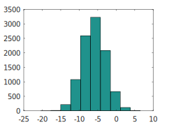
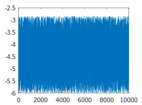
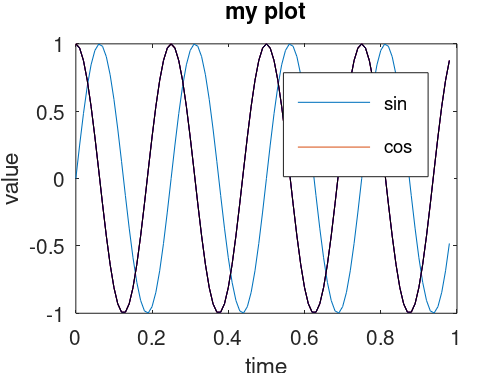
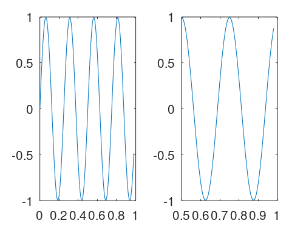
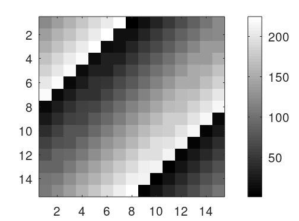

这篇文章跟大家分享一下Machine Learning的学习笔记: 03-MATLAB/Octave toturial。
<!--more-->
***
# 基本操作(Basic Operations)
## 改变提示字符串：
```
octave:1> PS1('>>');
>>
```
## 退出Octave
```
>>quit
```
or
```
>>exit
```
## 清除页面
```
>>clc
```
## 基本数学运算
```
>>3+5
ans = 8
>>5-3
ans = 2
>>6*3
ans = 18
>>6/2
ans = 3
>>3^2
ans = 9
>>sqrt(9)
ans = 3
```
## 逻辑运算
```
>>1==2
ans = 0  %返回值0代表false
>>1~=2
ans = 1  %返回值1代表true
>>1&&0
ans = 0
>>1||0
ans = 1
```
这里注意，不等于符号的写法是这个波浪线加上等于符号 ( ~= )，而不是等于感叹号加等号 ( != )，这是和其他一些编程语言中不太一样的地方。
## 结果显示
```
>>a=pi
a = 3.1416
>>disp(a)
3.1416
>>disp(sprintf('2 decimals: %0.2f',a))
2 decimals: 3.14
```
## 矩阵和向量
### 定义一个矩阵：
```
>>A = [1 2; 3 4; 5 6]
A =

   1   2
   3   4
   5   6
```
也可以用以下方式来定义一个矩阵：
```
>>A = [1 2;
> 3 4;
> 5 6]
A =

   1   2
   3   4
   5   6
```
### 定义一个向量：
```
>>v = [1 2 3]
v =

   1   2   3

>>v = [1; 2; 3]
v =

   1
   2
   3
```
### 全一矩阵(Matrix of ones)
```
>>ones(2,3)
ans =

   1   1   1
   1   1   1
```
类似的，如果想定义一个全是2的矩阵：
```
>>C = 2*ones(2,3)
C =

   2   2   2
   2   2   2
```
### 零矩阵(Zero matrix)
```
>>zeros(1,3)
ans =

   0   0   0
```
### 随机数矩阵
```
>>randn(2,3)
ans =

   0.3765   1.0025   0.3219
   1.4467   0.7443   1.3480
```

注意在MATLAB或者Octave中还有另外一个类似的随机数函数rand()。区别在于，rand是0-1的均匀随机分布，而randn是均值为0方差为1的正态分布。让我们将他们plot出来：
```
>>q = -6 + sqrt(10)*(randn(1,10000));
>>hist(q)
```

```
>>w = -6 + sqrt(10)*(rand(1,10000));
>>hist(w)
```


### 单位矩阵
```
>>eye(4)
ans =

Diagonal Matrix

   1   0   0   0
   0   1   0   0
   0   0   1   0
   0   0   0   1

```
# 移动数据
## 矩阵维度
### size()
```
>>A
A =

   1   2
   3   4
   5   6

>>size(A)
ans =

   3   2
```
另外我们可以显示使用如下命令来显示行数和列数：
```
>>size(A,1)
ans = 3
>>size(A,2)
ans = 2
```
### length()
length()函数可以用来显示矩阵的较长的维度（行或者列）
```
>>v = [1 2 3 4]
v =

   1   2   3   4

>>length(v)
ans = 4
>>length(A)
ans = 3
```
## 加载数据
```
>>load featuresX.dat
```
## 显示内存中的变量
### who
```
>>who
Variables visible from the current scope:

A    C    a    ans  q    v    w
```
### whos用于显示更加详细的信息
```
>>whos
Variables visible from the current scope:

variables in scope: top scope

  Attr   Name        Size                     Bytes  Class
  ====   ====        ====                     =====  =====
         A           3x2                         48  double
         C           2x3                         48  double
         a           1x1                          8  double
         ans         1x1                          8  double
         q           1x10000                  80000  double
         v           1x4                         32  double
         w           1x10000                  80000  double

Total is 20018 elements using 160144 bytes
```
## 清除内存中的变量
```
>>clear A
>>who
Variables visible from the current scope:

C    a    ans  q    v    w
```
## 数据存储
```
>>C
C =

   2   2   2
   2   2   2

>>save myData.txt C;
```
查看当前目录，我们就会发现新建了一个名为myData.txt的文件，内容如下：
```
# Created by Octave 7.2.0, Sat Aug 13 14:16:13 2022 GMT <unknown@Shi-Lap>
# name: C
# type: matrix
# rows: 2
# columns: 3
 2 2 2
 2 2 2
```
我们也可以加上ascii使得文件只显示数据：
```
>>save myData.txt C -ascii
```
文件内容如下：
```
 2.00000000e+00 2.00000000e+00 2.00000000e+00
 2.00000000e+00 2.00000000e+00 2.00000000e+00
```
## 操作数据
### 数据索引
```
>>A=[1 2; 3 4; 5 6]
A =

   1   2
   3   4
   5   6

>>A(3,2)
ans = 6
>>A(2,:)  %获取第二行的所有内容
ans =

   3   4
>>A(:,2)  %获取第二列的所有内容
ans =

   2
   4
   6
>>A([1 3],:)  %获取第一行和第三行的内容
ans =

   1   2
   5   6
```
### 改写数据
```
>>A
A =

   1   2
   3   4
   5   6

>>A(:,2)
ans =

   2
   4
   6

>>A(:,2)=[10; 11; 12]
A =

    1   10
    3   11
    5   12
```
### 追加数据
```
>>A
A =

      1   10
      3   11
      5   12

>>A=[A,[100; 101; 102]]
A =

     1    10   100
     3    11   101
     5    12   102

```
### 将所有数据放入一个向量
```
>>A(:)
ans =

     1
     3
     5
    10
    11
    12
   100
   101
   102
```
### 合并矩阵
```
>>A = [1 2; 3 4; 5 6];
>>B = [11 12; 13 14; 15 16];
>>A
A =

   1   2
   3   4
   5   6

>>B
B =

   11   12
   13   14
   15   16

>>C = [A B]
C =

    1    2   11   12
    3    4   13   14
    5    6   15   16

>>C = [A; B]
C =

    1    2
    3    4
    5    6
   11   12
   13   14
   15   16
```
# 计算数据
## 矩阵乘法
```
>>A
A =

   1   2
   3   4
   5   6

>>B
B =

   11   12
   13   14
   15   16

>>C = [1 1; 2 2]
C =

   1   1
   2   2

>>A*C
ans =

    5    5
   11   11
   17   17
```
## 矩阵点乘运算
两个矩阵A和B做点乘运算(A.\*B)是将对应元素相乘，例如：
```
>>A.*B
ans =

   11   24
   39   56
   75   96
```
同样的点次方，点除等运算：
```
>>A.^2
ans =

    1    4
    9   16
   25   36

>>1./A
ans =

   1.0000   0.5000
   0.3333   0.2500
   0.2000   0.1667
```
## 转置

```
>>A
A =

   1   2
   3   4
   5   6

>>A'
ans =

   1   3   5
   2   4   6
```
## 数值比较
```
>>a<3
ans =

  1  0  1  1  %0表示false, 1表示true

>>find(a<3)
ans =

   1   3   4  %所有小于3的值的Index number
```
## 常用函数
### magic()
magic函数可以生成一个行和列相加的和为一个定值的矩阵，比如：
```
>>A = magic(3)
A =

   8   1   6
   3   5   7
   4   9   2
```
### sum()
求和
```
>>a
a =

    1.0000   15.0000    2.0000    0.5000

>>sum(a)
ans = 18.500
```
### prod()
求乘积
```
>>prod(a)
ans = 15
```

### floor()
向下四舍五入
```
>>floor(a)
ans =

    1   15    2    0
```
### ceil()
向上四舍五入
```
>>ceil(a)
ans =

    1   15    2    1
```
## max()
求最大值
```
>>val = max(a)
val = 15
```
每一列的最大值
```
>>A
A =

   8   1   6
   3   5   7
   4   9   2
>>max(A,[],1)
ans =

   8   9   7
```
每一行的最大值
```
>>max(A,[],2)
ans =

   8
   7
   9
```
类似的，我们可以对矩阵进行每列或者每行求和和求积：
```
>>sum(A,1)
ans =

   15   15   15

>>sum(A,2)
ans =

   15
   15
   15
```
## 矩阵对角线求和
```
>>eye(3)
ans =

Diagonal Matrix

   1   0   0
   0   1   0
   0   0   1

>>A.*eye(3)
ans =

   8   0   0
   0   5   0
   0   0   2
>>sum(sum(A.*eye(3)))
ans = 15
```
## 矩阵求逆
pinv()函数可以计算矩阵的逆矩阵
```
>>pinv(A)
ans =

   0.147222  -0.144444   0.063889
  -0.061111   0.022222   0.105556
  -0.019444   0.188889  -0.102778
```
# 绘制数据
## 使用plot()函数快速绘图
```
>>t = [0:0.01:0.98];
>>y1 = sin(2*pi*4*t);
>>plot(t,y1)
```
## 使用hold on函数保存旧图
```
>>t = [0:0.01:0.98];
>>y1 = sin(2*pi*4*t);
>>y2 = cos(2*pi*4*t);
>>plot(t,y1)
>>hold on;
>>plot(t,y2)
```
这样新的图像就会绘制在旧的之上。
## 改变颜色
```
>>plot(t,y2,'k')
```
常用颜色：r--red; g--green; y--yellow;b--blue;k--black
## 添加坐标轴label
```
>>xlabel('time')
>>ylabel('value')
```
## 添加legend
```
>>legend('sin','cos')
```
## 添加title
```
>>title('my plot')
```
## 保存图片
```
>>print -dpng 'myplot.png'
```
## 关闭图片
```
>>close
```
最终绘制的图像如下：



## 图像标号
Octave/MATLAB也可以让你为图像标号。
```
>>figure(1);plot(t,y1);
>>figure(2);plot(t,y2);
```
这时你的电脑上将会显示名为'Figure 1'和'Figure 2'的两张不同的图片。
## subplot()
subplot命令可以让我们在一张图中展示多个plot。比如，我们使用subplot(1,2,1)命令，可以将图像分为一个 1\*2 的格子，也就是前两个参数，然后它使用第一个格子，也就是最后一个参数1的意思。同样的，我们也可以使用subplot(1,2,2)命令来使用第二个格子。
```
>>subplot(1,2,1)
>>plot(t,y1)
>>subplot(1,2,2)
>>plot(t,y2)
```

## 设置坐标轴范围
```
>>axis([0.5 1 -1 1])  %x轴坐标0.5到1;y轴坐标-1到1
```
新绘制的图像如下：



## 清除图像
```
>>clf;
```
## 可视化矩阵
使用 imagesc(A)命令，它将会绘制一个彩色格图，不同的颜色对应矩阵中的不同值。
```
>>imagesc(A)
```
还可以使用colorbar和colormap gray来对图像进行进一步调整。
```
>>imagesc(magic(15))，colorbar，colormap gray
```
运行以上代码，可以得到一个如下所示的15\*15的彩格图。



## 同时使用多条命令

上面的例子中，我们使用的逗号连接函数调用。如果我键入a=1,b=2,c=3然后按Enter键，其实这是将这三个命令同时执行，或者是将三个命令一个接一个执行，它将输出所有这三个结果。
```
>>a=1,b=2,c=3
a = 1
b = 2
c = 3
```

# 控制语句：for, while, if
## for循环
```
>>v=zeros(10,1)
v =

   0
   0
   0
   0
   0
   0
   0
   0
   0
   0

>>for i=1:10,
> v(i)=2^i;
> end;
>>v
v =

      2
      4
      8
     16
     32
     64
    128
    256
    512
   1024
```
## while循环
```
>> i = 1;
>> while i<= 5,
> v(i)=100;
> i=i+1;
> end;
>> v
v =

    100
    100
    100
    100
    100
     64
    128
    256
    512
   1024
```
## if...else...
```
>> v(1) = 2;
>> if v(1)==1,
>   disp('The value is one');
> elseif v(1)==2,
>   disp('The value is two');
> else
>   disp('The value is not one or two.');
> end;
The value is two
```
## 定义函数
例如，我们可以在当前目录定义一个函数squareThisNumber.m来返回一个数值的平方数，函数内容如下：
```
function y = squareThisNumber(x)
y = x^2;
```
在Octave中就可以这样调用刚才定义的函数：
```
>> squareThisNumber(5)
ans = 25
```
我们还可以定义一个返回两个数值的函数squareAndCubeThisNumber.m，用于返回一个数值的平方数以及立方数，函数内容如下：
```
function [y1,y2] = squareAndCubeThisNumber(x)
y1 = x^2;
y2 = x^3;
```
同样的我们可以调用刚才定义的函数：
```
>> [a,b]=squareAndCubeThisNumber(5);
>> a
a = 25
>> b
b = 125
```
## 定义Cost Function
可以用上面提到的定义函数的方法来定义Cost Function J。新建一个名为costFunctionJ.m的函数，并且包含如下内容：
```
function J = costFunctionJ(X, y, theta)

% X is the "design matrix" containing our training examples.
% y is the class labels

m = size(X, 1);         % number of training examples
predictions = X*theta;  % predictions of hypothesis on all m examples
sqrErrors = (predictions-y).^2; % squared errors

J = 1/(2*m)*sum(sqrErrors);
```

下面是使用costFunctionJ的两个例子：
```
>> X = [1 1; 1 2; 1 3]
X =

   1   1
   1   2
   1   3

>> y = [1; 2; 3]
y =

   1
   2
   3

>> theta = [0; 1]
theta =

   0
   1

>> j = costFunctionJ(X, y, theta)
j = 0
>> theta = [0; 0]
theta =

   0
   0

>> j = costFunctionJ(X, y, theta)
j = 2.3333
```
# 向量化(Vectorization)
使用向量计算可以使计算速度变得更快，而且可以使代码更加简洁。

## 假设函数\\(h_{\theta}(x)\\)的向量化计算
### \\(\tehta_0\\)
$$
h_{\theta}(x)=\sum_{j=0}^n\theta_jx_j=\theta^Tx
$$
我们分别使用循环和向量化两种方式来对上面的例子进行计算。

不使用向量化：
```
prediction = 0.0;
for j = 1:n+1
  predition = prediction + theta(j)*x(j)
end;
```
使用向量化：
```
prediction = theta' * x;
```
## 使用向量化来更新线性回归梯度下降的\\(\theta_j\\)
$$
\theta_0 := \theta_0-\alpha\frac{1}{m}\sum_{i=1}^{m}(h_\theta(x^{(i)})-y{(i)})x_0^{(i)}
$$
$$
\theta_1 := \theta_1-\alpha\frac{1}{m}\sum_{i=1}^{m}(h_\theta(x^{(i)})-y{(i)})x_1^{(i)}
$$
$$
\theta_2 := \theta_2-\alpha\frac{1}{m}\sum_{i=1}^{m}(h_\theta(x^{(i)})-y{(i)})x_2^{(i)}
(n=2)
$$
这里我们可以将这些方程等价为：
$$
\theta := \theta - \alpha\delta
$$
$$
\delta=\frac{1}{m}\sum_{i=1}^{m}(h_\theta(x^{(i)})-y^{(i)})x^{(i)}
$$
其中，\\(\theta,\delta\\)为n+1维度的向量，\\(\alpha\\)为实数，这样我们就把上面的方程等价为了向量计算。
