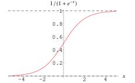

这篇文章跟大家分享一下Machine Learning的学习笔记: 06-逻辑回归(Logistic Regression)。
<!--more-->
***
# 分类问题
在分类问题中，我们尝试预测的是结果是否属于某一个类（例如正确或错误）。分类问的例子有：
+ 判断一封电子邮件是否是垃圾邮件？
+ 判断一次金融交易是否是欺诈？
+ 区别一个肿瘤是恶性的还是良性的？

$$
y\in\{0,1\}
$$
0: 负向类（例如，表示良性肿瘤）
1：正向类（例如，表示恶性肿瘤）

**线性回归解决分类问题的难点**：假设函数的输出值可能远大于1，或者远小于 0。
$$
h_\theta(x)\ can\ be\ >1\ or\ <0
$$

**逻辑回归(Logistic Regression)** ：它的输出值永远在 0 到 1 之间。
$$
0\leq h_\theta(x)\leq 1
$$

# 假说表示

线性回归模型，因为其预测的值可以超越[0,1]的范围，并不适合解决分类问题。

我们引入一个新的模型，逻辑回归，该模型的输出变量范围始终在 0 和 1 之间。 逻辑 回归模型的假设是：
$$
h_\theta(x)=g(\theta^Tx)
$$

X表示特征向量，g表示逻辑函数(Logistic Function)。

一个常用的逻辑函数为Sigmoid function，公式为：
$$
h_\theta(x)=\frac{1}{1+e^{-\theta^Tx}}
$$
其图形为：



\\(h_\theta(x)\\)函数的意义为：对于给定的输入变量，计算输出变量 =1的概率

例如：如果对于给定的x，通过已经确定的参数计算得出\\(h_\theta(x)=0.7\\)，则表示有70%的几率y为正向类，相应地y为负向类的几率为 1-0.7=0.3。

$$
P(y=0|x;\theta) = 1 - P(y=1|x;\theta)
$$

# 判定边界

决策边界(decision boundary)这个概念能更好地帮助我们理解逻辑回归的假设函数在计算什么。

在上面的逻辑回归的Sigmoid函数模型中，

当\\(h_\theta<0.5\\)时，也就是\\(\theta^Tx<0\\)时，预测"y = 0"；

当\\(h_\theta \geq 0.5\\)时，也就是\\(\theta^Tx \geq 0\\)时，预测"y = 1"；

现在假设我们有如下模型，并且\\(\theta_0=-3, \theta_1=1, \theta_2=1\\)：


当\\(-3+x_1+x_2 \geq 0\\)，即\\(x_1+x_2 \geq 3\\)时，模型将预测y=1。我们可以绘制直线\\(x_1+x_2=3\\)作为模型的分界线，将预测为1的区域和预测为0的区域分隔开。


同样的，我们可以用半径为1，圆心在原点的圆将如下的模型分隔开。


也就是\\(h_\theta(x) = g(\theta_0 +\theta_1x_1 + \theta_2x_2 +\theta_3x_2^2 + \theta_4x_2^2）\\)，其中\\(\theta\\)为[-1 0 0 1 1]。

# 代价函数

假设我们有如下training sets，如何使用逻辑回归模型来找到代价函数的最优解呢？


在之前的线性回归模型中，我们定义的代价函数是所有模型误差的平方和。理论上来说，我们也可以对逻辑回归模型沿用这个定义，但是问题在于，当我们将\\(h_\theta(x)=\frac{1}{1+e^{-\theta^Tx}}\\)代入之后，我们得到的代价函数将是一个非凸函数(non-convexfunction)。这意味着我们的代价函数有许多局部最小值，这将影响梯度下降算法寻找全局最小值。!


所以，我们重新定义逻辑回归的代价函数为：
$$
Cost(h_\theta(x), y) = \begin{cases}
-log(h_\theta(x))& if\ \ y = 1\\\\
-log(1-h_\theta(x))& if\ \ y = 0
\end{cases}
$$
\\(h_\theta(x)\\)与\\(Cost(h_\theta(x), y))\\)之间的关系如下：


**左图**：

在当实际的\\(y=1\\)，且\\(h_\theta(x)\\)也为1时,误差Cost为0；

但是，如果\\(h_\theta(x)\\)趋向于0的时候，Cost就会趋向于\\(\infty\\)。

**右图**：

当实际的\\(y=0\\)，且\\(h_\theta(x)\\)也为0时,误差Cost为0；

但是，如果\\(h_\theta(x)\\)趋向于1的时候，Cost就会趋向于\\(\infty\\)。

简化之后的cost function如下：

$$
J(\theta) = \frac{1}{m}\sum_{i=1}^{m}Cost(h_\theta(x^{(i)}), y^{(i)})\\\\
= -\frac{1}{m}[\sum_{i=1}^{m}y^{(i)}log h_\theta(x^{(i)}) + (1-y^{(i)})log(1-h_\theta(x^{(i)}))]
$$

这样，无论y=0还是y=1，我们都可以使用这个方程。

# 梯度下降 (gradient descent)

在得到上面的Cost Function之后，我们就可以使用梯度下降的算法来求得能使代价函数最小的\\(\theta\\)参数值了。具体算法为：
$$
\theta_j := \theta_j - \alpha\frac{\partial}{\partial\theta_j}J(\theta)
$$

求导后得到：

$$
\theta_j := \theta_j - \alpha\frac{1}{m}\sum_{i=1}^m(h_\theta(x^{i})-y^{(i)})x_j^{(i)}
$$

注：虽然得到的梯度下降算法表面上看上去与线性回归的梯度下降算法一样，但是这里的\\(h_\theta(x)=g(\theta^TX)\\)与线性回归中不同，所以实际上是不一样的。另外，在运行梯度下降算法之前，进行特征缩放依旧是非常必要的。

# 算法优化

一些梯度下降算法之外的选择： 除了梯度下降算法以外，还有一些常被用来令代价函数最小的算法，这些算法更加复杂和优越，而且通常不需要人工选择学习率，通常比梯度下降算法要更加快速。这些算法有：共轭梯度（Conjugate Gradient），局部优化法(Broyden fletcher goldfarb shann,BFGS)和有限内存局部优化法(LBFGS) ，fminunc是 matlab和octave 中都带的一个最小值优化函数，使用时我们需要提供代价函数和每个参数的求导，下面是 octave 中使用 fminunc 函数的代码示例：

```
function [jVal, gradient] = costFunction(theta)

    jVal = [...code to compute J(theta)...];
    gradient = [...code to compute derivative of J(theta)...];
    
end
    
options = optimset('GradObj', 'on', 'MaxIter', '100');
    
initialTheta = zeros(2,1);
    
[optTheta, functionVal, exitFlag] = fminunc(@costFunction, initialTheta, options);
```

# 多类别分类：一对多

多类别分类的例子：
+ 邮件标签： 工作、朋友、家庭、爱好
+ 医学诊断： 没有生病、感冒、流感
+ 天气：晴朗、多云、下雨、下雪

二元分类和多类别分类数据的区别：


我们可以将多个类中的一个类标记为正向类（y=1），然后将其他所有类都标记为负向类，这个模型记作\\(h_\theta^{(1)}(x)\\)。接着，类似地第我们选择另一个类标记为正向类（y=2），再将其它类都标记为负向类，将这个模型记作\\(h_\theta^{(2)}(x)\\),依此类推。 最后我们得到一系列的模型简记为\\(h_\theta^{(i)}(x)=P(y=i|x;\theta)\\)： 其中：i = (1,2,3)

最后，在我们需要做预测时，我们将所有的分类机都运行一遍，然后对每一个输入变量，都选择最高可能性的输出变量。