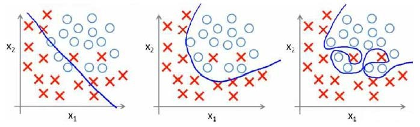

这篇文章跟大家分享一下Machine Learning的学习笔记: 07-正则化(Regularization)。
<!--more-->

# 过度拟合的问题
我们已经学习了几种不同的学习算法，包括线性回归和逻辑回归，它们能够有效地解决许多问题，但是当将它们应用到某些特定的机器学习应用时，会遇到过度拟合(over-fitting)的问题，可能会导致它们效果很差。

下面是一个回归问题的例子：


第一个模型是一个线性模型，欠拟合，不能很好地适应我们的训练集；第三个模型是一个四次方的模型，过于强调拟合原始数据，而丢失了算法的本质：预测新数据。我们可以看出，若给出一个新的值使之预测，它将表现的很差，是过拟合，虽然能非常好地适应我们的训练集但在新输入变量进行预测时可能会效果不好；而中间的模型似乎最合适。

分类问题中也存在这样的问题：



应该如何处理过度拟合问题？

+ 减少特征数量。
  * 可以是手工选择保留哪些特征
  * 使用一些模型选择的算法来帮忙（例如PCA）

+ 正则化。 
  * 保留所有的特征，但是减少参数的大小（magnitude）。
  * 适用于有多个特征，但每个特征对预测函数的贡献都比较小。

# 代价函数

上面的回归问题中如果我们的模型是：  \\(h_\theta(x)=\theta_0+\theta_1x_1+\theta_2x_2^2+\theta_3x_3^3+\theta_4x_4^4\\) 我们可以从之前的事例中看出，正是那些高次项导致了过拟合的产生，所以如果我们能让这些高次项的系数接近于0的话，我们就能很好的拟合了。 所以我们要做的就是在一定程度上减小这些参数 的值，这就是**正则化的基本方法**。

我们决定要减少和的大小，我们要做的便是修改代价函数，在其中和 设置一点惩罚。这样做的话，我们在尝试最小化代价时也需要将这个惩罚纳入考虑中，并最终导致选择较小一些的和。 修改后的代价函数如下：

$$
J(\theta\)= \frac{1}{2m}[\sum_{i=1}^m(h_\theta(x^{(i)})-y^{(i)})^2+1000\theta_3^2+1000\theta_4^2]
$$

类似的，假如我们有非常多的特征，我们并不知道其中哪些特征我们要惩罚，我们将对除\\(\theta_0\\)以外的所有的特征进行惩罚，并且让代价函数最优化的软件来选择这些惩罚的程度。这样的结果是得到了一个较为简单的能防止过拟合问题的假设：

$$
J(\theta)=\frac{1}{2m}[\sum_{i=1}^{m}h_\theta(x^{(i)})-y^{(i)})^2+\lambda \sum_{j=1}^{n}\theta_j^2]
$$

如果我们令\\(\lambda\\)的值很大的话，为了使Cost Function 尽可能的小，所有的 \\(\theta\\)的值（不包括\\(\theta_0\\)）都会在一定程度上减小。 但若\\(\lambda\\)的值太大了，那么\\(\theta\\)（不包括\\(\theta_0\\)）都会趋近于0，这样我们所得到的只能是一条平行于轴的直线。 所以对于正则化，我们要取一个合理的\\(\lambda\\)的值，这样才能更好的应用正则化。 

# 正则化线性回归

正则化线性回归的代价函数为：

$$
J(\theta)=\frac{1}{2m}[\sum_{i=1}^{m}h_\theta(x^{(i)})-y^{(i)})^2+\lambda \sum_{j=1}^{n}\theta_j^2]
$$

如果我们要使用梯度下降法令这个代价函数最小化，因为我们未对进行正则化，所以梯度下降算法将分两种情形：

$$
\theta_0 := \theta_0 - \alpha\frac{1}{m}\sum_{i=1}^{m}(h_\theta(x^{(i)})-y^{(i)})x_0^{(i)}
$$
$$
\theta_j := \theta_j - \alpha[\frac{1}{m}\sum_{i=1}^{m}(h_\theta(x^{(i)})-y^{(i)})x_j^{(i)}+\frac{\lambda}{m}\theta_j]\ \ \ \ \ \ for\  j = 1,2,3...
$$

将上面的公式稍加整理，即可得到：
$$
\theta_j := \theta_j(1-\alpha\frac{\lambda}{m}) - \alpha\frac{1}{m}[\sum_{i=1}^{m}(h_\theta(x^{(i)})-y^{(i)})x_j^{(i)}]
$$

可以看出，正则化线性回归的梯度下降算法的变化在于，每次都在原有算法更新规则的基础上令值减少了一个额外的值。

我们同样也可以利用正规方程来求解正则化线性回归模型，方法如下所示：

$$
\theta = \begin{pmatrix}
X^TX+\lambda\begin{bmatrix}
0&\ &\ &\ &\ \\\\
\ &1 &\ &\ &\ \\\\
\ &\ &1 &\ &\ \\\\
\ &\ &\ &\ddots &\ \\\\
\ &\ &\ &\ &1 \end{bmatrix}
\end{pmatrix}^{-1} X^Ty
$$

# 正则化的逻辑回归模型

我们也给代价函数增加一个正则化的表达式，得到代价函数：
$$
J(\theta)= -\frac{1}{m}[\sum_{i=1}^{m}y^{(i)}log h_\theta(x^{(i)}) + (1-y^{(i)})log(1-h_\theta(x^{(i)}))]+\frac{\lambda}{2m}\sum_{j=1}^{n}\theta_j^2
$$

要最小化该代价函数，通过求导，得出梯度下降算法为：

$$
\theta_0 := \theta_0 - \alpha\frac{1}{m}\sum_{i=1}^m(h_\theta(x^{i})-y^{(i)})x_0^{(i)}
$$
$$
\theta_j := \theta_j - \alpha[\frac{1}{m}\sum_{i=1}^m(h_\theta(x^{i})-y^{(i)})x_j^{(i)}+\frac{\lambda}{m}\theta_j]
$$
注：看上去同线性回归一样，但是知道\\(h_\theta(x)=g(\theta^TX)\\) ，所以与线性回归不同。 Octave 中，我们依旧可以用 fminuc 函数来求解代价函数最小化的参数，值得注意的是参数\\(\theta_0\\)的更新规则与其他情况不同。

下面是 octave 中使用 fminunc 函数的代码示例：

```
function [jVal, gradient] = costFunction(theta)

    jVal = [...code to compute J(theta)...];

    gradient(1) = [...code to compute derivative of the partial derivative of cost function at theta_0];

    gradient(2) = [...code to compute derivative of the partial derivative of cost function at theta_1];
    .
    .
    .
    gradient(n+1) = [...code to compute derivative of the partial derivative of cost function at theta_n];
    
end
    
options = optimset('GradObj', 'on', 'MaxIter', '100');
    
initialTheta = zeros(n+1,1);
    
[optTheta, functionVal, exitFlag] = fminunc(@costFunction, initialTheta, options);
```
