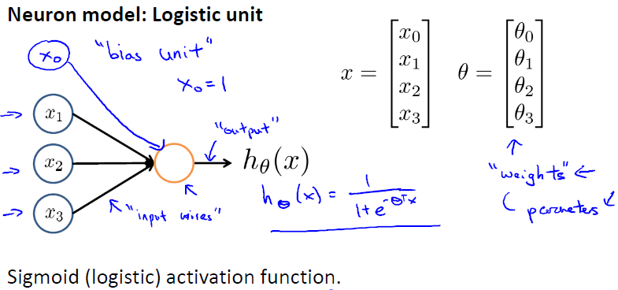
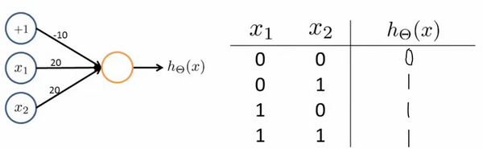
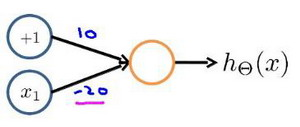
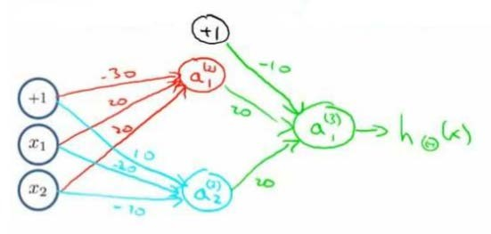
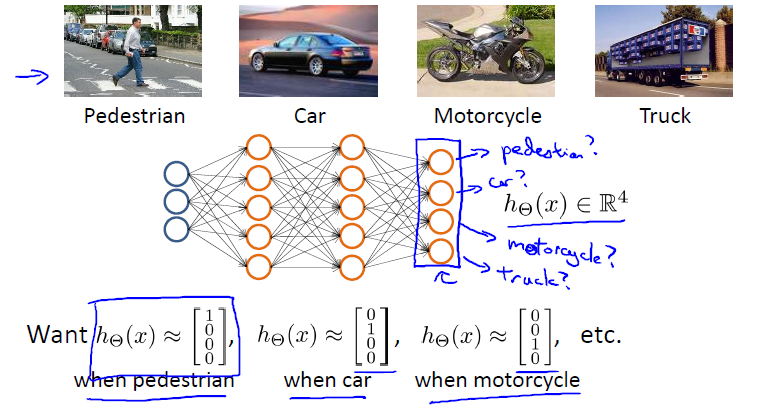
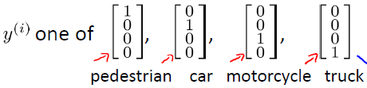

这篇文章跟大家分享一下Machine Learning的学习笔记: 09-神经网络：表述(Neural Networks: Representation)。
<!--more-->

# 非线性假设

我们之前学的，无论是线性回归还是逻辑回归都有这样一个缺点，即：当特征太多时，计算的负荷会非常大。

在特征值相对较少时，使用非线性的多项式项，能够帮助我们建立很好的分类模型。假设我们有非常多的特征（比如大于100个变量），我们希望用这100个特征来构建一个非线性的多项式模型，结果将是数量非常惊人的特征组合，即便我们只采用两两特征的组合，我们也会有接近5000个组合而成的特征。这对于一般的逻辑回归来说需要计算的特征太多了。

同样，在识别图像的训练模型中，由于每一个像素都是一个特征值，即使50x50的像素的小图片都会有 2500个特征，如果我们要进一步将两两特征组合构成一个多项式模型，则会有约产生至少300万个特征(\\(2500^2/2\\))。很显然，普通的逻辑回归模型，不能有效地处理这么多的特征，这时候我们需要神经网络。

# 模型表示
神经网络模型建立在很多神经元之上，每一个神经元又是一个个学习模型。这些神经元（也叫激活单元，activation unit）采纳一些特征作为输出，并且根据本身的模型提供一个输出。下图是一个以逻辑回归模型作为自身学习模型的神经元示例，在神经网络中，参数又可被成为权重（weight）。

我们设计出了类似于神经元的神经网络，效果如下：

其中\\(x_1,x_2,x_3\\) 是输入单元（input units），我们将原始数据输入给它们。\\(a_1,a_2,a_3\\) 是中间单元，它们负责将数据进行处理，然后呈递到下一层。 最后是输出单元，它负责计算\\(h_\theta(x)\\)。

下面引入一些标记法来帮助描述模型：

**\\(a_i^{(j)}\\) : 代表第j层的第i个激活单元**

**\\(\theta^{(j)}\\) : 代表从第j层映射到第j+1层时的权重的矩阵**
+ 例如\\(\theta^{(1)}\\)代表从第一层映射到第二层的权重的矩阵
+ 矩阵维度为：以第j+1层的激活单元数量为行数，以第j层的激活单元数加一为列数

对于上图所示的模型，激活单元和输出分别表达为：

$$
a_1^{(2)} = g(\theta_{10}^{(1)}x_0+\theta_{11}^{(1)}x_1+\theta_{12}^{(1)}x_2+\theta_{13}^{(1)}x_3)
$$
$$
a_2^{(2)} = g(\theta_{20}^{(1)}x_0+\theta_{21}^{(1)}x_1+\theta_{22}^{(1)}x_2+\theta_{23}^{(1)}x_3)
$$
$$
a_3^{(2)} = g(\theta_{30}^{(1)}x_0+\theta_{31}^{(1)}x_1+\theta_{32}^{(1)}x_2+\theta_{33}^{(1)}x_3)
$$
$$
h_\theta(x)=a_1^{(3)}=g(\theta_{10}^{(2)}a_0^{(2)}+\theta_{11}^{(2)}a_1^{(2)}+\theta_{12}^{(2)}a_2^{(2)}+\theta_{13}^{(2)}a_3^{(2)})
$$

我们可以知道：每一个\\(a\\)都是由上一层所有的\\(x\\)和每一个\\(x\\)所对应的\\(\theta\\)决定的。我们把这样从左到右的算法称为前向传播算法(FORWARD PROPAGATION)。

上面的公式可以简化为：
$$
a^{(2)}=g(z^{(2)})
$$
其中，\\(z^{(2)}=\theta\*X\\)。

我们可以继续使用同样的方法计算下一层的值：
$$
h_\theta(x)=a^{(3)}=g(z^{(3)})
$$
其中，\\(z^{(3)}=\theta^{(2)}\*a^{(2)}\\)。

# 实例和直观理解

神经网络中，单层神经元（无中间层）的计算可用来表示逻辑运算，比如逻辑与(AND)、逻辑或(OR)。

我们可以使用下面的神经网络来表示逻辑与（AND）。

我们设置权重为（-30,20,20），输出函数\\(h_\theta(x)=g(-30+20x_1+20x_2)\\)。我们知道g(x)的图像为：

所以当我们将\\(x_1\\)和\\(x_2\\)分别设置为0和1时，会得到如下结果：

我们发现只有当\\(x_1\\)和\\(x_2\\)同时为1时，我们的输出结果才为1，也就是AND的逻辑运算。

逻辑或（OR）跟上面的AND类似，只是权重设置不同（三个权重分别设置为-10,20,20）。

下面的神经元（权重分别设置为10,-20）可以被视为等同于逻辑非（NOT):

我们可以利用神经元来组合成更为复杂的神经网络以实现更复杂的运算。例如我们要实现XNOR功能（输入的两个值必须一样，均为1或均为0），即\\(XNOR=(x_1\ AND\ x_2)OR((NOT\ x_1)AND(NOT\ x_2))\\)。

首先构造一个能表达\\((NOT\ x_1)AND(NOT\ x_2)\\)部分的神经元：

然后将表示\\(x_1\ AND\ x_2\\)的神经元和表示\\((NOT\ x_1)AND(NOT\ x_2)\\)的神经元，以及表示\\(OR\\)的神经元相组合：

我们就得到了一个能实现XNOR运算符功能的神经网络。

# 多类分类

当我们有不止两种分类时（也就是y=1,2,3...），比如以下这种情况，该怎么办？

如果我们要训练一个神经网络算法来识别路人、汽车、摩托车和卡车，在输出层我们应该有4个值。例如，第一个值为1或0用于预测是否是行人，第二个值用于判断是否为汽车。

下面是该神经网络的可能结构示例：

神经网络算法的输出结果为四种可能情形之一：

